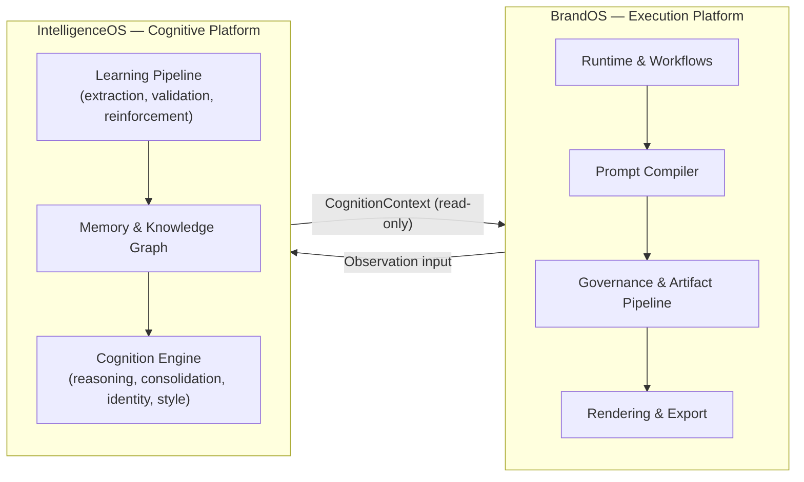

# Intelligence Platform Architecture

**Status:** Canonical — target steady state
**Scope:** BrandOS ↔ IntelligenceOS system boundary
**This document describes where the platform is going, not where it is today.**

---

## 1. Vision

BrandOS and IntelligenceOS exist as two platforms, not one, because they answer two different questions and grow along two different axes.

BrandOS answers: *how do we take a request and produce a governed, on-brand, exported artifact, reliably and fast?* Its pressure comes from execution concerns — runtime stability, prompt assembly, policy enforcement, rendering fidelity, export correctness. It should be free to ship quickly, change providers, add artifact types, and evolve its pipeline without asking whether any of that touches how the system learns.

IntelligenceOS answers: *what has this workspace taught us, and what does that mean for the next output?* Its pressure comes from cognition concerns — signal extraction, semantic consolidation, memory decay, identity resolution, reasoning over accumulated context. It should be free to change its models, its consolidation strategy, its knowledge representation, and its learning loop without asking whether any of that breaks an export pipeline.

Collapsing these into one platform was tried implicitly — BrandOS grew a `brand-intelligence` package that did real cognition work (signal extraction, style projection, memory consolidation) inside the execution platform. That coupling is exactly what capped its growth: cognition changes had to be shipped through execution's release cadence, and execution's release cadence had to carry cognition's complexity. Splitting them is not a reorganization for its own sake — it is the removal of a load-bearing dependency that was slowing both platforms down.

The second reason is reuse. IntelligenceOS was built to solve semantic intelligence problems generally, not for BrandOS specifically. A platform split is what lets IntelligenceOS serve other products later without carrying BrandOS's execution concerns along with it, and lets BrandOS stay a thin, fast-moving consumer of cognition rather than its owner.

---

## 2. Architectural Principles

- **BrandOS is the Execution Platform.** It owns everything required to turn a request into a delivered artifact: runtime, prompt compilation, governance, rendering, export, workflows.
- **IntelligenceOS is the Cognitive Platform.** It owns everything required to understand a workspace and produce judgment about it: learning, memory, knowledge, identity, style, reasoning, context building.
- **IntelligenceOS is the single source of truth for cognition.** If a question is "what does this workspace's brand sound like" or "what have we learned from past outputs," there is exactly one place that question is answered — IntelligenceOS — never a local approximation inside BrandOS.
- **BrandOS consumes cognition but never implements it.** BrandOS may read the *result* of cognition and use it to compile a prompt or gate an output. It may never compute, re-derive, approximate, or cache a *judgment* — that would be a second implementation of intelligence.
- **No duplicated intelligence logic.** If a capability exists in IntelligenceOS, no equivalent — not a simplified version, not a fallback version, not a "for now" version — is allowed to exist in BrandOS. One capability, one owner, one implementation.

---

## 3. Responsibility Matrix

| Capability | Owner | Notes |
|---|---|---|
| Runtime (request orchestration, provider execution) | **BrandOS** | Execution concern end to end. |
| Prompt Compiler | **BrandOS** | Assembles the final prompt string. Consumes cognition as data; contains no cognition logic itself. |
| Governance | **BrandOS** | Policy enforcement over outputs. Operates on what IntelligenceOS returns; does not decide what is "true" about the brand. |
| Artifact Pipeline | **BrandOS** | Generation-to-artifact assembly. |
| Rendering | **BrandOS** | Turning artifacts into visual output. |
| Export | **BrandOS** | Delivery of final artifacts to external formats/destinations. |
| Workflows | **BrandOS** | Multi-step user-facing processes. |
| Asset Upload / Workspace / Authentication / User State | **BrandOS** | Platform plumbing, not cognition. |
| Learning | **IntelligenceOS** | Signal extraction, feedback processing, reinforcement over time. |
| Memory | **IntelligenceOS** | Storage, retrieval, and decay of everything the system has learned. |
| Knowledge (extraction, validation, vocabulary, frameworks) | **IntelligenceOS** | Pattern-level understanding of content — never re-implemented locally. |
| Signal Consolidation | **IntelligenceOS** | Resolving conflicting or overlapping signals into a coherent position. |
| Confidence Calculation | **IntelligenceOS** | Any score describing how much to trust a piece of learned knowledge. |
| Brand Identity | **IntelligenceOS** | Semantic and visual identity resolution. |
| Style Projection | **IntelligenceOS** | Producing the style-relevant subset of identity for generation use. |
| Knowledge Graph | **IntelligenceOS** | Structural representation of concepts and their relationships. |
| Reasoning | **IntelligenceOS** | Any inference step that goes beyond direct data lookup. |
| Context Building | **IntelligenceOS** | Assembling the resolved cognitive picture of a workspace. |

The dividing line in one sentence: **if the work changes when a user clicks "generate," it's BrandOS; if the work changes when the system gets smarter, it's IntelligenceOS.**

---

## 4. System Boundary

**What crosses the boundary:**
- `CognitionContext` — flows IntelligenceOS → BrandOS. The complete, pre-resolved answer to "what does this workspace's cognition currently say."
- Observation input — flows BrandOS → IntelligenceOS. A report of what happened (what was generated, how it scored, in what workspace) with no interpretation attached.
- Review/feedback actions — flow BrandOS → IntelligenceOS. A human decision (approve/reject a learned signal) passed through, not evaluated, by BrandOS.
- Health status — flows IntelligenceOS → BrandOS. A signal of whether cognition is available, for degraded-mode handling.

**What never crosses the boundary:**
- No repository handles, resolver classes, or runtime instances. BrandOS never holds a reference to anything IntelligenceOS uses internally to do its job.
- No raw signals. BrandOS never sees an unconsolidated memory entry, an intermediate extraction result, or a partially-resolved identity — only finished judgments.
- No cognition methods. BrandOS never calls a method that *performs* reasoning, consolidation, or resolution — it only calls methods that *retrieve* an already-computed result.
- No cognition-side persistence details. BrandOS does not know how or where memory is stored, decayed, or versioned.
- No execution concerns in the other direction. IntelligenceOS never knows about prompt formatting, rendering, export targets, or governance policy — it returns data and is finished.

If a future change requires BrandOS to import anything from IntelligenceOS other than the `CognitionContext` contract and the client that fetches it, that change is crossing the boundary incorrectly.

---

## 5. CognitionContext

`CognitionContext` is the entire cognitive surface BrandOS is permitted to know about. It is read-only data — no behavior, no methods that compute anything, nothing BrandOS could use to derive a judgment IntelligenceOS didn't already reach. Conceptually, it has five sections:

**Identity.** The resolved answer to "who does this workspace sound and look like" — pre-gated, pre-consolidated, ready to be dropped into a prompt or a governance check without further interpretation.

**Voice.** The prompt-ready expression of tone, cadence, audience, and constraints (such as banned phrasing). This is the section the Prompt Compiler leans on most directly — it is already in the shape a prompt fragment needs, not a shape that needs further cognitive work.

**Visual Identity.** The style-relevant visual attributes (color, font character, density) needed by rendering and presentation — resolved, not raw signal data about visual preferences.

**Confidence.** A single, honest signal of how much the rest of the context should be trusted — degraded, low, medium, or high — so BrandOS can decide how strongly to apply what it received without needing to know why.

**Provenance.** Minimal, diagnostic-only information (how much was learned, when it was last consolidated) for logging and observability. This section exists for humans debugging the system, never for BrandOS to branch its logic on.

Two things are true of every section: they are the *output* of cognition, never an ingredient BrandOS could recombine into a new judgment, and they are complete — BrandOS never needs to make a second call to "finish" what a `CognitionContext` started.

The write side is symmetric and equally narrow: BrandOS reports an observation (what was generated, how it scored, where) and IntelligenceOS decides what that means. BrandOS never classifies, scores, or interprets what it observed — it only reports.

---

## 6. High-Level Architecture Diagram

---

## 7. Design Principles

**Single source of truth.** Every cognitive fact — a tone preference, a confidence score, a resolved identity — exists in exactly one place. BrandOS never holds a copy that could drift from IntelligenceOS's answer.

**Separation of execution and cognition.** Execution changes (a new export format, a faster runtime, a new governance rule) and cognition changes (a better consolidation strategy, a richer knowledge graph) are independent events. Neither platform's release should be blocked by, or need to reason about, the other's internals.

**Business contracts instead of implementation contracts.** The boundary between the platforms is expressed as `CognitionContext` — a description of *what cognition means for this request* — not as shared classes, shared repositories, or shared runtime interfaces. BrandOS depends on a concept, not on how IntelligenceOS is built.

**Replace duplicated intelligence with platform capabilities.** Wherever BrandOS previously approximated a cognitive capability locally, that capability is retired in favor of calling IntelligenceOS. There is no "good enough for BrandOS" version of a capability IntelligenceOS already owns — there is only the platform capability, consumed.

**Consume data, never behavior.** A component in BrandOS is only ever allowed to read fields off a `CognitionContext`. If a component needs to *call* something in order to get an answer, that something belongs in IntelligenceOS, and the answer belongs in the contract instead.

---

## 8. Future Direction

New AI capabilities are classified by a single rule, applied before any design or implementation work begins:

**If it is execution, it goes in BrandOS. If it is learning or reasoning, it goes in IntelligenceOS.**

In practice:

- A new artifact type, a new export target, a new rendering style, a new governance policy, a new orchestration step — these change how a request is executed. They belong in BrandOS, and they should never require a change to `CognitionContext`.
- A new way of extracting signal from content, a new consolidation strategy, a new dimension of identity, a new reasoning capability over accumulated knowledge — these change what the system understands. They belong in IntelligenceOS, and they surface to BrandOS, if at all, as an addition to `CognitionContext` — never as a new method BrandOS calls directly.
- If a proposed capability seems to require both — for example, a new kind of generation that needs a new kind of judgment — the judgment-producing half is built in IntelligenceOS and exposed as new fields on the contract; the execution-consuming half is built in BrandOS against those fields. The two are designed and shipped as two changes, not one, even when they land in the same release.
- If it is genuinely unclear which side a capability belongs on, the test is: *does this capability get better as the system observes more usage over time, or does it stay the same regardless of history?* Capabilities that improve with accumulated history are cognition. Capabilities that are correct or incorrect independent of history are execution.

This document is the reference for that decision. Any architecture proposal that blurs the Execution/Cognition split — by adding cognition logic to BrandOS, by adding execution concerns to IntelligenceOS, or by widening `CognitionContext` into something BrandOS could use to derive new judgments — should be treated as a violation of this architecture, not a variant of it.
