# BrandOS Intelligence Contracts

> **Historical specification document.** The formal activation-contract document that defines the phase-by-phase capability model IntelligenceOS implements. §J (the phased activation sequence) is explicitly referenced in the Bootstrap (§10) as more detailed than what the Bootstrap summarises — it remains useful as the authoritative source for domain activation triggers and deferred-capability reasoning. The Postgres schema in this document has since been superseded by `src/db/schema.sql` as the single source of truth.

**Document Class:** Architectural Bridge Document — Implementation-Ready
**Status:** Derived from Approved Architecture (No Redesign)
**Authority Documents:** BrandOS Brand Intelligence Learning Framework v1.0 · BrandOS Intelligence Architecture v1.0 · BrandOS Logical Intelligence Schema v1.0
**Scope:** Producer, validation, consumer, ownership, flow, and runtime contracts required to implement the approved architecture
**Excludes:** Databases, APIs, frameworks, storage technology, infrastructure — this is a logical contract layer only

---

> **Architectural Axiom (extended):**
> The Taxonomy defines *what* BrandOS learns.
> The Architecture defines *how* intelligence is organized and consumed.
> The Logical Schema defines *the entities, relationships, lifecycle, and conflict model*.
> **This document defines *who does what, when, in what order, and under whose authority* — the contracts that bind the schema to runtime behavior.**

---

## Document Position in the Architecture Chain

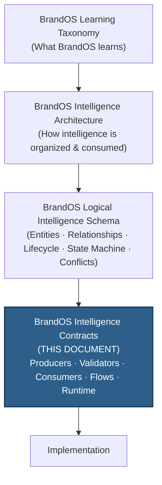

All three authority documents are treated as approved and final. Nothing in this document redesigns, critiques, or replaces them. Every contract below is a direct derivation: each producer, validator, consumer, flow, and runtime component is traceable to an entity, domain, lifecycle rule, or principle already defined in the Logical Intelligence Schema (Sections A–L), the Intelligence Architecture (Sections A–L), or the Learning Taxonomy (Sections A–I).

---

## Table of Contents

- [Section A — Intelligence Producer Contracts](#section-a--intelligence-producer-contracts)
- [Section B — Intelligence Validation Contracts](#section-b--intelligence-validation-contracts)
- [Section C — Intelligence Consumer Contracts](#section-c--intelligence-consumer-contracts)
- [Section D — Runtime Intelligence Composition Model](#section-d--runtime-intelligence-composition-model)
- [Section E — Intelligence Flow Contracts](#section-e--intelligence-flow-contracts)
- [Section F — Intelligence Ownership Contracts](#section-f--intelligence-ownership-contracts)
- [Section G — Artifact Generation Contract](#section-g--artifact-generation-contract)
- [Section H — Quality Improvement Contracts](#section-h--quality-improvement-contracts)
- [Section I — Conceptual Runtime Components](#section-i--conceptual-runtime-components)
- [Section J — Phase-Based Implementation Recommendation](#section-j--phase-based-implementation-recommendation)
- [Appendix — Contract Cross-Reference Index](#appendix--contract-cross-reference-index)

---

# Section A — Intelligence Producer Contracts

## A.1 — Producer Model Principle

> **Contract Principle:** Every intelligence entity has exactly one producing pathway category, even when multiple producer *instances* can invoke it. No entity is "produced" by ambient inference alone — every entity traces to an explicit producer responsibility, an input source set, and an output specification. This closes the ambiguity gap the Logical Schema's Section L Contract Map opened but did not fully formalize into responsibility contracts.

Producers fall into four categories, derived directly from Logical Schema Section L.2 and Architecture Section G.1:

| Producer Category | Description | Examples |
|---|---|---|
| **Human-Originated** | The User (or Workspace admin) directly creates the entity through explicit action | Project creation, Knowledge Asset upload, explicit Goal statement |
| **Pipeline-Originated** | The Signal → Observation → Hypothesis → Learning pipeline produces the entity as a validated output | Preference, Framework, Archetype (behavioral), Relationship |
| **Curation-Originated** | Human-curated at design/launch time, refined by aggregate data thereafter | Artifact Pattern (Universal), Artifact Pattern (Archetype) |
| **System-Originated** | Produced automatically as a structural byproduct of another entity's lifecycle event | Signal, Observation, Feedback Event, Artifact Blueprint, Conflict |

---

## A.2 — Intelligence Producer Contract Table

For each major intelligence entity, this table defines the **Producer**, **Producer Responsibility**, **Input Sources**, and **Output Produced**, per Logical Schema Sections A.2, B.1–B.17, and L.2.

| Entity | Producer | Producer Responsibility | Input Sources | Output Produced |
|---|---|---|---|---|
| **Signal** | System (Signal Extractor, system-originated) | Extract raw, unvalidated observations from every input event and tag with `source_type` and `context_flags` | Prompts, uploads, Feedback Events, edits, explicit statements, behavioral traces | Raw `Signal` records, immediately routed to the pipeline or quarantined |
| **Observation** | Pipeline (Observation Builder) | Attach taxonomy category, context, source-quality classification, and an initial confidence estimate to a validated Signal | Non-quarantined Signals | `Observation` records with confidence ceiling set by source quality |
| **Hypothesis** | Pipeline (Hypothesis Engine) | Match Observation to an existing Hypothesis (corroboration/contradiction) or create a new one; track corroboration/contradiction counts | Observations | `Hypothesis` records in state `PROVISIONAL` or `ACCUMULATING` |
| **Learning** | Pipeline (Learning Validator) | Promote a Hypothesis that has met its corroboration threshold (per stability class) with no unresolved high-quality contradictions | Validated Hypotheses | `Learning` records entering state `VALIDATED` |
| **Intelligence Profile** | User Intelligence (Profile Builder) | Assemble and version the consolidated User model from all active Learnings, weighted by Taxonomy impact hierarchy | Learnings (all domains), prior Profile version | New/updated `Intelligence Profile` version |
| **Archetype** | Pipeline (from onboarding + behavioral signals); User (explicit self-identification as provisional seed) | Maintain weighted, multi-archetype distribution; trigger re-evaluation on career-shift signals | Onboarding responses, uploaded artifacts, vocabulary patterns, explicit statements | `Archetype` records with confidence and weight |
| **Goal (User)** | User (explicit statement); Pipeline (inferred, provisional) | Capture and re-validate desired outcomes per `time_horizon` | Conversation, onboarding, project context | `Goal` records scoped `owner_type: User` |
| **Goal (Project)** | User (explicit, at project scoping); Pipeline (inferred from project artifacts) | Capture project-specific outcomes distinct from personal Goals | Project scoping conversation, uploaded project assets | `Goal` records scoped `owner_type: Project` |
| **Constraint (User)** | User (explicit); Pipeline (inferred, provisional) | Capture limits the User operates under | Conversation, onboarding | `Constraint` records scoped `owner_type: User` |
| **Constraint (Project)** | User (explicit, at scoping); Pipeline (inferred from project artifacts) | Capture project-bounded limits | Project scoping, uploaded assets | `Constraint` records scoped `owner_type: Project` |
| **Constraint (Compliance)** | Workspace Admin (explicit) | Define immutable, workspace-wide compliance rules | Admin configuration, legal/regulatory input | `Constraint` records scoped `owner_type: Workspace`, `hard_or_soft: hard` |
| **Preference** | Pipeline (Learning Validator, from Feedback Events and editing deltas) | Form and refine format/structure/depth/tone/vocabulary/narrative dispositions | Feedback Events, Delta Learning (edit deltas), explicit style statements | `Preference` records scoped by `artifact_type_scope` and `context_scope` |
| **Framework** | Pipeline (from uploaded artifacts and conversational pattern detection) | Detect and register intellectual models/methodologies the User applies | Uploaded artifacts (strategy docs, papers), repeated framework-language usage | `Framework` records; if `proprietary_flag: true`, also registers a `Knowledge Asset` |
| **Operating Principle** | Pipeline (from repeated emphatic statements); User (explicit declaration) | Register near-permanent values/non-negotiables | Repeated statements across sessions, explicit declarations | `Operating Principle` records (near-permanent) |
| **Vocabulary Model** | Pipeline (continuous extraction); Knowledge Intelligence (from Knowledge Asset extraction) | Accumulate domain-specific, idiosyncratic, and organizational terminology | Writing samples, uploads, Knowledge Assets, Project context | `Vocabulary Model` records scoped User / Project / Workspace |
| **Knowledge Asset** | User (explicit upload); Workspace Admin (shared assets) | Initialize asset; trigger extraction of vocabulary, patterns, and structure | Uploaded documents (playbooks, frameworks, methodologies, IP) | `Knowledge Asset` record + derived `Knowledge Vocabulary` / `Knowledge Pattern` |
| **Relationship** | Pipeline (from conversation/artifact context, second mention); User (explicit description) | Initialize and enrich profiles of specific named people/organizations | Conversation mentions, artifact recipients, explicit user description | `Relationship` records |
| **Audience Profile (Generic)** | User Intelligence (Pipeline, from User-level Audience Intelligence category) | Build generic recipient-class calibration models | Conversation context, onboarding | `Audience Profile` records, `owner_type: User` |
| **Audience Profile (Specific)** | Relationship Intelligence (1:1 with Relationship) | Build named-recipient calibration models | Relationship profile, artifact outcomes for that Relationship | `Audience Profile` records, `owner_type: Relationship` |
| **Artifact Pattern (Universal)** | Curation (human-curated at launch); Cross-user aggregation post-scale (>10K users) | Define canonical structural baseline per artifact type | Expert/human design; anonymized cross-user acceptance data at scale | `Artifact Pattern` records, `pattern_level: universal` |
| **Artifact Pattern (Archetype)** | Curation + Pipeline (archetype-specific accepted artifacts) | Modify universal pattern for a confirmed Archetype | Universal Pattern + accepted artifacts from users sharing the Archetype | `Artifact Pattern` records, `pattern_level: archetype` |
| **Artifact Pattern (User-Calibrated)** | Pipeline (Learning Validator, from this User's Feedback Events) | Build user-specific structural model after ≥2 accepted exemplars | This User's Feedback Events, editing patterns | `Artifact Pattern` records, `pattern_level: user_calibrated` |
| **Artifact Blueprint** | Artifact Intelligence (Blueprint Builder, synthesis) | Assemble structure + narrative + depth decisions from all relevant domain inputs for one generation event | Artifact Pattern, Intelligence Profile, Project (if active), Relationship/Audience Profile, Workspace standards, resolved Conflicts | `Artifact Blueprint` record (ephemeral, per generation event) |
| **Artifact** | Generation System (consumes Blueprint) | Generate the discrete output | Artifact Blueprint | `Artifact` record, delivered to User |
| **Artifact Exemplar** | Artifact Intelligence (promoted from accepted/deployed Artifacts) | Promote a specific Artifact to permanent structural reference | Artifact + Feedback Event (`accepted` or `deployed`) | `Artifact Exemplar` record |
| **Feedback Event** | User (response to delivered Artifact, explicit or behavioral) | Record User response type and any edit diff | Delivered Artifact, User action (accept/edit/reject/deploy/explicit feedback) | `Feedback Event` record |
| **Conflict** | Artifact Blueprint Assembly (detected pre-generation, system-originated) | Detect disagreements between domain intelligence sources before generation | Loaded domain intelligence during Blueprint assembly | `Conflict` record, resolved per Section J resolution rules |
| **Project** | User (explicit creation) | Initialize project identity, type, primary objective | User's explicit project-creation action | `Project` record in lifecycle state `Ideation` |
| **Workspace** | Admin / Workspace Owner | Establish organizational standards, vocabulary, asset library, compliance constraints | Admin configuration at workspace setup | `Workspace` record |
| **User** | Registration / Onboarding System | Create root entity; trigger Intelligence Profile initialization | Registration event | `User` record + initial empty `Intelligence Profile` |

---

## A.3 — Producer Responsibility Notes

> [!IMPORTANT]
> **Pipeline-Originated entities are never produced directly by a "producer" in the conventional sense.** The Learning Pipeline (Section I, Signal Extractor → Observation Builder → Hypothesis Engine → Learning Validator) is the sole producer of Observation, Hypothesis, and Learning. No other component may write directly to these entity types. This is a hard architectural boundary inherited from Logical Schema Section D.

> [!NOTE]
> **Knowledge Asset production is bifurcated by Section I of the Logical Schema.** A Knowledge Asset is always human-originated (explicit upload), but its *derived* entities — Knowledge Vocabulary, Knowledge Pattern, registered Framework — are system-originated extraction outputs that occur automatically upon upload, subject to Validation (Section B).

> [!NOTE]
> **Artifact Pattern production follows the Three-Level inheritance defined in Logical Schema H.3.** Universal patterns are produced once (curation) and inherited downward. Archetype patterns are produced only when an Archetype reaches Confirmed confidence. User-Calibrated patterns are produced only after ≥2 accepted exemplars (Logical Schema B.15 Validation Rules).

---

# Section B — Intelligence Validation Contracts

## B.1 — Validation Model Principle

> **Contract Principle:** Validation is the gate that separates "BrandOS observed something" from "BrandOS knows something." Every promotion across the Intelligence State Machine (Logical Schema Section E) is governed by a Validation Contract: a `Validation Owner` (who/what enforces the rule), a `Validation Trigger` (what event invokes the check), `Validation Rules` (the threshold logic), `Promotion Rules` (what happens on success), and `Rejection Rules` (what happens on failure). This section formalizes those four properties for every state transition and entity-level promotion defined in the Logical Schema.

---

## B.2 — Core Pipeline Validation Contracts

These four contracts govern the Signal → Observation → Hypothesis → Learning → Intelligence Profile pipeline (Logical Schema Section D).

### Signal → Observation

| Property | Definition |
|---|---|
| **Validation Owner** | Learning Pipeline — Signal Extractor (Stage 1 gate) |
| **Validation Trigger** | A `Signal` record is created from any input event |
| **Validation Rules** | Inspect `context_flags`. If any of `role_play`, `hypothetical`, or `emotional_state` is present, the Signal is quarantined. A quarantined Signal proceeds only if it explicitly describes the User's own persistent identity or preference (explicit override). Single-session task-specific Signals (e.g., "make this shorter") are capped at session scope regardless of flags. |
| **Promotion Rules** | Non-quarantined (or explicitly-overridden) Signals proceed to Observation Formation with `source_quality` classified (`explicit_statement` / `demonstrated_behavior` / `uploaded_artifact` / `inferred`), which sets the confidence ceiling per the Ceiling Rule (Logical Schema D.3). |
| **Rejection Rules** | Quarantined Signals without explicit override are discarded immediately. Discarded Signals are not retained — per Taxonomy Section H, role-play and hypothetical signals must never extract identity/preference data. |

---

### Observation → Hypothesis

| Property | Definition |
|---|---|
| **Validation Owner** | Learning Pipeline — Hypothesis Engine (Stage 3 gate) |
| **Validation Trigger** | A validated `Observation` is produced |
| **Validation Rules** | Search for an existing `Hypothesis` matching `taxonomy_category` + `target_entity_type` + `target_entity_id`. If found, classify the new Observation as corroborating or contradicting. If not found, create a new Hypothesis in state `PROVISIONAL` with `required_corroborations` set per stability class (Permanent → 2, Long-Term → 3, Medium-Term → 2). A single Observation never sets `required_corroborations` below 2 (Logical Schema B.11 Validation Rules). |
| **Promotion Rules** | ≥1 corroborating Observation moves a `PROVISIONAL` Hypothesis to `ACCUMULATING`. |
| **Rejection Rules** | A contradicting Observation of equal/greater source quality halves the Hypothesis's confidence and moves it to `CHALLENGED` (Logical Schema E.3). A `PROVISIONAL` Hypothesis with zero corroboration within 30 days is `DISCARDED`, unless its taxonomy category is `permanent` stability class. |

---

### Hypothesis → Learning

| Property | Definition |
|---|---|
| **Validation Owner** | Learning Pipeline — Learning Validator (Stage 4–5 gate) |
| **Validation Trigger** | An `ACCUMULATING` Hypothesis receives a new corroborating Observation, or a `CHALLENGED` Hypothesis receives a resolving corroboration |
| **Validation Rules** | Promotion occurs only when `current_corroborations ≥ required_corroborations` **and** there are no unresolved high-confidence contradictions. ≥2 high-quality contradictions on a `CHALLENGED` Hypothesis force `REJECTED` regardless of corroboration count (Logical Schema E.3). Three or more corroborations with zero contradictions allow direct promotion at High confidence (Escalation Rule, Logical Schema D.4). |
| **Promotion Rules** | On success: create a `Learning` record, assign `stability_class` (from Taxonomy category), assign `decay_rate` (from `stability_class`), assign `context_scope` (global / artifact_type / project / audience), and enter state `VALIDATED`. |
| **Rejection Rules** | Hypotheses that time out without meeting threshold are `DISCARDED`. Hypotheses with ≥2 high-quality contradictions are `REJECTED` — confidence reduced to zero, not persisted as Learning. Hypotheses formed **only** from role-play, hypothetical, or emotional-state contexts are permanently ineligible for promotion (Logical Schema B.12 Validation Rules). |

---

### Learning → Intelligence Profile

| Property | Definition |
|---|---|
| **Validation Owner** | User Intelligence — Profile Builder |
| **Validation Trigger** | A `Learning` enters state `VALIDATED` or `CONFIRMED`; or any Learning transitions to `DECAYING`, `FLAGGED`, or `ARCHIVED` |
| **Validation Rules** | The Profile must reflect the current active set of Learnings, weighted by Taxonomy impact-priority hierarchy (Taxonomy Section G). A Profile rebuild (new version) is required when >3 high-confidence Learnings are added, or when a `permanent` stability-class Learning changes (identity, operating principles). A Profile not validated against new Learnings in >60 days is flagged for refresh (Logical Schema B.2 Validation Rules). |
| **Promotion Rules** | On rebuild: increment `version`, recompute `overall_confidence_score` as a composite of constituent Learning confidences, update domain-model references (`voice_model_ref`, `goal_model_ref`, `expertise_model_ref`, `constraint_model_ref`, etc.), and trigger Blueprint refresh for affected artifact types (Logical Schema D.1 Stage 6). |
| **Rejection Rules** | Not applicable in the binary sense — the Profile cannot "reject" a Learning that has already passed pipeline validation. However, if `overall_confidence_score` drops below 40%, the Profile is flagged for onboarding re-enrichment and low-confidence dimensions are excluded from artifact calibration until restored (Logical Schema D.4). |

---

## B.3 — Entity-Specific Validation Contracts

For entities outside the core pipeline, the same four-property contract applies, derived from each entity's Logical Schema Validation Rules (Section B.1–B.17).

| Entity | Validation Owner | Validation Trigger | Validation Rules | Promotion Rules | Rejection Rules |
|---|---|---|---|---|---|
| **Archetype** | User Intelligence (Pipeline) | New corroborating signal of archetype-aligned vocabulary, uploaded artifact, or explicit self-identification | A single signal never exceeds Low confidence. High confidence requires ≥10 consistent signals from ≥3 distinct signal types. Multi-archetype weights must sum to 1.0. | Low → Medium-Provisional (explicit self-ID) → Medium (3–9 signals, 2+ types) → High (≥10 signals, ≥3 types, ≥2 artifact types) → Confirmed (High + behavioral corroboration across ≥2 sessions) | Contradictory vocabulary pattern decreases confidence or splits into competing Archetype hypotheses; major career-change signals trigger reset + re-evaluation, with the former Archetype archived (not deleted) |
| **Goal** | Owning domain (User Intelligence or Project Intelligence) | Goal stated/inferred; `time_horizon` revalidation interval reached | Re-confirmation required at the interval set by `time_horizon`. Immediate goals expire after 30 days without confirmation. Annual goals re-confirm at 90 and 180 days. | Low (single context inference) → Medium (explicitly stated) → High (stated + corroborated by artifact requests) → Confirmed (High + success metrics defined + multiple artifacts generated in service of the goal) | Goal expires if not reconfirmed within its `time_horizon` window; expired Goals are excluded from Blueprint relevance framing until reconfirmed |
| **Constraint** | Owning domain (User / Project / Workspace) | Constraint stated/inferred; context-change signal received | Hard constraints must never be violated by generation. Workspace compliance constraints are always Hard. Soft constraints may be departed from only under higher-precedence conflict rules, with departure surfaced. | Low (inferred) → Medium (stated once) → High (stated + corroborated/demonstrated) → Confirmed (explicitly stated as non-negotiable) | A soft Constraint contradicted without re-affirmation decays per its stability class; Hard Constraints are never demoted |
| **Preference** | User Intelligence / Artifact Intelligence (shared per Logical Schema F.1) | Feedback Event or edit-delta observed | A Preference contradicted ≥2 times without a corresponding confirmation must be demoted or split into context-specific sub-preferences. Single-session instructions never create Preferences. Role-play/hypothetical observations are discarded. | Session-scoped → Provisional (1 non-role-play observation) → Low (2) → Medium (3–5 consistent, 0 contradictions) → High (6+ consistent, ≤1 contradiction) → Confirmed (High + explicit User affirmation) | ≥2 uncorroborated contradictions force demotion or context-split |
| **Framework** | User Intelligence | Framework-language pattern detected across artifacts/conversations | A Framework from a single artifact is Provisional only. ≥3 distinct artifacts/conversations escalate to Medium. `proprietary_flag: true` triggers parallel Knowledge Asset registration. | Provisional (1 observation) → Low (2) → Medium (3+, ≥2 distinct contexts) → High (5+ + explicit User reference by name) | Frameworks that fail to recur across ≥3 contexts remain Provisional indefinitely and are not loaded into Blueprint assembly |
| **Knowledge Asset** | Knowledge Intelligence | Explicit upload event; re-upload (versioning); explicit deprecation | Explicit upload carries Very High confidence immediately. Conversationally-inferred assets carry Low confidence until upload confirmation. Never shared cross-user without explicit workspace authorization. | Low (inferred from description) → Medium (stated and described) → High (uploaded, unverified) → Very High (uploaded + User confirmation) → Confirmed (Very High + used successfully in accepted artifacts) | Assets explicitly marked deprecated by the User are removed from active generation context but retained in archive |
| **Relationship** | Relationship Intelligence | Second mention of a named person/org; artifact directed at them; >90 days without mention | A Relationship with only one supporting signal carries Low confidence and must not override User preferences. >90 days without context appearance triggers a decay flag. A relationship that ends/changes fundamentally is archived; a new profile is created for any continuation. | Provisional (first mention) → Low (second mention, no artifact) → Medium (second mention + ≥1 artifact directed at them) → High (multiple artifacts + User-provided profile info) → Confirmed (High + positive outcomes attributed to calibration) | Decay-flagged Relationships have confidence reduced on each subsequent generation cycle until either revalidated or archived |
| **Audience Profile** | Relationship Intelligence (specific) / User Intelligence (generic) | Artifact directed at this audience type/recipient; explicit User description | When both a generic and a specific (Relationship-linked) profile exist for the same recipient, the specific profile always takes precedence. | Low (inferred from general knowledge) → Medium (User-described) → High (User-described + artifact feedback corroboration) → Confirmed (High + multiple successful calibrations) | A profile contradicted by Feedback Events on calibrated artifacts is flagged for review per the same 2-contradiction logic as Preference |
| **Artifact Pattern (User-Calibrated)** | Artifact Intelligence | Feedback Event on an artifact of this type | A user-calibrated pattern requires ≥2 accepted exemplars before it overrides Universal/Archetype baseline. `rejection_count ≥ 2` triggers drift-detection review. Consistent same-way edits to a section (≥3 occurrences) are incorporated as a pattern update. | Baseline (pre-built universal) → Provisional-Calibrated (1 accepted exemplar) → Calibrated (2+ exemplars, 0 rejections) → High-Calibrated (5+ exemplars, stable editing patterns) → Confirmed (10+ exemplars, consistently accepted without structural edits) | `rejection_count ≥ 2` does not delete the pattern but forces a drift-detection review before further reinforcement |
| **Operating Principle** | User Intelligence | Repeated emphatic statement across sessions; explicit declaration | Near-permanent — changed only by explicit User declaration or strong contradictory evidence. | Provisional (1 statement) → Confirmed (repeated emphatic statements OR explicit declaration) | Strong contradictory evidence does not auto-demote; it generates an alert for User review per the Permanent-category Escalation Rule (Logical Schema D.4) |
| **Conflict** | Cross-Domain (Conflict Resolution Model) | Detected during Artifact Blueprint Assembly | Recurring Conflicts (≥3 appearances in same context) must generate a persistent Conflict Record surfaced to the User rather than silently re-resolved. Workspace compliance Conflicts are never User-overridable. | Resolved Conflicts apply their `resolution_rule_applied` outcome to the Blueprint immediately | N/A — Conflicts are binary (exists/resolved), not subject to rejection; recurrence is tracked via `recurring_count` |

---

## B.4 — Validation Contract: Special Cases

> [!WARNING]
> **Permanent-class Learnings (Professional Identity core, Operating Principles, Knowledge Assets) cannot be auto-demoted.** Per Logical Schema B.12 and E.4, a `permanent` stability-class Learning requires explicit User action **or** strong contradictory evidence (≥High confidence from ≥2 independent sources) to transition out of `CONFIRMED`/`ACTIVE`. Even when this threshold is met, the system generates an alert for User review rather than silently archiving — this is the only Validation Contract in the system where promotion to `ARCHIVED` requires a non-automatic step.

> [!NOTE]
> **User Correction is the highest-authority Validation event in the system.** Per the Correction Override Rule (Logical Schema D.3), an explicit User correction immediately sets the corrected Learning to `Confirmed` confidence and supersedes the prior Learning — bypassing the normal corroboration-threshold pathway entirely. This applies across all entity-specific validation contracts in B.3 without exception.

---

# Section C — Intelligence Consumer Contracts

## C.1 — Consumer Model Principle

> **Contract Principle:** Every intelligence entity that is produced and validated is consumed by one or more named runtime components. A consumer contract defines *who consumes* an entity, *under what conditions*, and *what authority rules govern* that consumption. Consumers cannot bypass domain ownership boundaries (Logical Schema Section F) or the conflict precedence hierarchy (Logical Schema Section J.5). This section formalizes consumption rights for every entity in the schema.

---

## C.2 — Consumer Contract Table

| Entity | Primary Consumer(s) | Secondary Consumer(s) | Consumption Condition | Authority Rules at Consumption |
|---|---|---|---|---|
| **Signal** | Learning Pipeline — Observation Builder | None (ephemeral) | Immediately upon creation; discarded after Observation formation or quarantine | Context-flag quarantine gate must be applied before consumption; no secondary consumption permitted |
| **Observation** | Learning Pipeline — Hypothesis Engine | None (ephemeral) | Immediately upon formation; consumed into Hypothesis formation | Confidence ceiling from source quality must carry forward into Hypothesis |
| **Hypothesis** | Learning Pipeline — Learning Validator | None (internal pipeline) | At each new corroboration or contradiction event; at timeout check | Contradiction Rule and Corroboration Threshold must be checked at every consumption event |
| **Learning** | Intelligence Profile Builder (User Intelligence) | Domain stores (User / Project / Artifact / Relationship / Workspace / Knowledge) | Upon promotion from VALIDATED; on every state transition | `context_scope` must be enforced — a Learning scoped to `executive_summary` must not be consumed in a `research_paper` Blueprint |
| **Intelligence Profile** | Artifact Blueprint Builder | Project Context Builder, Audience Calibrator, Narrative Planner, Artifact Evaluator, Quality Reviewer | At every artifact generation event (full load); at quality evaluation (targeted load) | Must check Profile version date; Profiles flagged for refresh (>60 days since last Learning update) must be flagged at consumption with reduced confidence on decaying dimensions |
| **Archetype** | Intelligence Profile Builder | Artifact Pattern selector (default calibration); Artifact Blueprint Builder (depth/vocabulary defaults) | When Intelligence Profile is loaded for generation; when Pattern level selection is performed | Multi-archetype distributions: primary Archetype governs defaults; secondary Archetypes inform edge-case enrichment only |
| **Goal (User)** | Artifact Blueprint Builder (relevance framing) | Artifact Evaluator (relevance scoring); Narrative Planner | At Blueprint assembly; at Quality Evaluation stage | Goals must be checked against `expires_at` before consumption; expired Goals must not be used for relevance framing without reconfirmation |
| **Goal (Project)** | Project Context Builder | Artifact Blueprint Builder (context grounding) | Whenever a Project is active and in scope for the current artifact | Project Goals govern artifact-level context; they do not override User-level Goals for overall framing (Architecture Section I.2) |
| **Constraint (User)** | Artifact Blueprint Builder | Conflict Detection Model | At Blueprint assembly | Hard Constraints must block any Blueprint element that would violate them; Soft Constraints are passed to Conflict Detection for resolution |
| **Constraint (Project)** | Project Context Builder | Artifact Blueprint Builder | At Blueprint assembly for project-scoped artifacts | Overrides User Constraints within project scope per the Scope Rule (Conflict Rule 1) |
| **Constraint (Compliance)** | Artifact Blueprint Builder (final pass) | Quality Reviewer (compliance check) | Applied as final pass before artifact delivery; checked again in Quality Evaluation | Immutability Rule: compliance Constraints cannot be overridden by any other signal; applied unconditionally after all other intelligence is assembled |
| **Preference** | Artifact Blueprint Builder | Audience Calibrator; Narrative Planner; Structure Planner | At Blueprint assembly; filtered by `artifact_type_scope` and `context_scope` | Preferences are applied after Artifact Pattern structure is selected; they refine within sections, not override canonical structure (Additive Rule) |
| **Framework** | Narrative Planner | Artifact Blueprint Builder (structural/argumentative scaffolding); Structure Planner | At Blueprint planning stage when artifact type benefits from a reasoning framework | Only Frameworks at ≥Medium confidence are loaded into active Blueprint assembly |
| **Operating Principle** | Artifact Blueprint Builder (values filter) | Artifact Evaluator; Quality Reviewer | At Blueprint assembly; at Quality Evaluation | Near-permanent confidence means Operating Principles are treated as always-active Constraints unless explicitly overridden for a session |
| **Vocabulary Model (User)** | Artifact Blueprint Builder | Generation System (vocabulary layer) | At Generation stage; loaded as part of Intelligence Profile | User Vocabulary overrides generic language; Project Vocabulary overrides User Vocabulary within project scope; Workspace Vocabulary governs external artifacts |
| **Vocabulary Model (Project)** | Project Context Builder | Artifact Blueprint Builder | At Blueprint assembly for project-scoped artifacts | Overrides User Vocabulary within project scope only; does not persist to User model |
| **Vocabulary Model (Workspace)** | Artifact Blueprint Builder (external artifacts) | Quality Reviewer (compliance) | At Blueprint assembly; final compliance pass | Workspace Vocabulary governs external artifacts; User Vocabulary is applied within those constraints |
| **Knowledge Asset** | Artifact Blueprint Builder | Narrative Planner; Structure Planner; Generation System | When artifact type is relevant to the asset; when User or Project owns the asset | Knowledge Assets inform but do not mandate structure; User wins when structure preference conflicts (Logical Schema J.3). Access Rules (`access_scope`) must be checked before loading |
| **Relationship** | Audience Calibrator | Artifact Blueprint Builder | When artifact has a named recipient who matches a Relationship profile | Only Relationships at ≥Low confidence are loaded; Relationships below Low confidence must not override User preferences |
| **Audience Profile (Generic)** | Audience Calibrator | Artifact Blueprint Builder | When artifact has an audience type but no named Relationship profile exists | Generic profiles are used as fallback only; if a specific Relationship-linked profile exists, it takes precedence per Logical Schema B.14 |
| **Audience Profile (Specific)** | Audience Calibrator | Artifact Blueprint Builder | When artifact has a named recipient and a Relationship profile with confidence ≥Medium exists | Specific profiles override generic profiles for that named recipient; Recipient Rule (Conflict Rule 2) applies |
| **Artifact Pattern (Universal)** | Artifact Blueprint Builder — Structure Planner | Generation System | From Day 1 (pre-built); used when no Archetype or User-Calibrated pattern exists at sufficient confidence | Consumed as structural baseline; overridden by Archetype pattern when Archetype is Confirmed; further overridden by User-Calibrated pattern when ≥2 exemplars exist |
| **Artifact Pattern (Archetype)** | Artifact Blueprint Builder — Structure Planner | Generation System | When User's primary Archetype is ≥Confirmed and Archetype pattern exists for this artifact type | Overrides Universal baseline; overridden by User-Calibrated pattern |
| **Artifact Pattern (User-Calibrated)** | Artifact Blueprint Builder — Structure Planner | Artifact Exemplar reference pool | When ≥2 accepted exemplars exist for this User + artifact type combination | Overrides both Universal and Archetype baselines; this is the highest-priority structural authority for artifact generation |
| **Artifact Blueprint** | Generation System | None | Immediately upon assembly; single-use per generation event | The Blueprint is the complete, resolved intelligence package for generation; no mid-generation intelligence loading is permitted after Blueprint is finalized (prevents drift) |
| **Artifact Exemplar** | Artifact Blueprint Builder (structural reference) | Artifact Pattern reinforcement | At Blueprint assembly when User-Calibrated pattern is consulted | Exemplars are reference models, not templates; they inform structural decisions, they do not mandate them |
| **Artifact** | User (recipient) | Feedback Event system; Artifact Intelligence (quality logging) | Upon delivery | Delivered Artifact triggers Feedback Event capture; the Artifact record is retained as audit and potential Exemplar candidate |
| **Feedback Event** | Signal Extractor (immediate pipeline input) | Artifact Intelligence; domain update triggers | Immediately upon recording | Every Feedback Event produces ≥1 Signal; no Feedback Event is discarded without Signal extraction |
| **Conflict** | Conflict Resolution Model | Artifact Blueprint Builder (receives resolution output); User (notification when Transparency Rule applies) | During Blueprint assembly | Resolution rules applied per Logical Schema J.4 (five rules); User notified per Transparency Rule when departure from preference is significant |
| **Project** | Project Context Builder | Artifact Blueprint Builder; Vocabulary Model loader; Constraint set loader; Goal set loader | Whenever a Project is active (`Execution` lifecycle state) | Project intelligence is loaded in full for project-scoped artifacts; archived Projects require explicit retrieval and are not actively consumed |
| **Workspace** | Workspace Context Loader | Artifact Blueprint Builder (standards layer); Quality Reviewer (compliance) | At every artifact generation event for workspace-enrolled Users | Workspace standards are applied before User/Project context; Compliance Constraints are applied last as immutable final pass |

---

## C.3 — Consumer Priority Resolution

When multiple consumers require the same entity simultaneously during Blueprint assembly, the following priority order governs load sequence (derived from Architecture Section H.2 — Eight Transformation Stages):

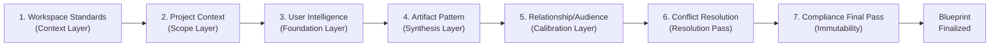

> [!NOTE]
> Load order is not authority order. Load order determines the sequence of assembly. Authority order (Logical Schema J.5, Levels 1–5) determines which entity wins when two loaded entities conflict.

---

# Section D — Runtime Intelligence Composition Model

## D.1 — Composition Principle

> **Contract Principle:** When a user issues any artifact request, BrandOS must assemble a precise, ordered intelligence context package before generation begins. This section defines what intelligence is loaded, in what order, for seven canonical artifact types. Each composition model is derived directly from Architecture Section G.2 (Artifact-Specific Intelligence Flow Analysis) and Section H.2 (Eight Transformation Stages).

---

## D.2 — General Composition Contract

Regardless of artifact type, every generation event follows this contract sequence:

```mermaid
flowchart TD
    R["User Request Received"] --> I["1. Intent Parse\nArtifact type · Audience · Project context"]
    I --> W["2. Workspace Context Load\nStandards · Compliance Constraints · Shared Assets"]
    W --> P["3. Project Context Load\n(if active project)\nGoals · Vocabulary · Stakeholders · Assets"]
    P --> U["4. User Intelligence Load\nVoice · Expertise · Goals · Frameworks · Preferences"]
    U --> AP["5. Artifact Pattern Load\nUniversal → Archetype → User-Calibrated\n(highest available level)"]
    AP --> RL["6. Relationship/Audience Load\n(if named recipient)\nGeneric Audience Profile or Specific Relationship Profile"]
    RL --> KA["7. Knowledge Asset Load\n(if relevant to artifact type and owned by User/Project/Workspace)"]
    KA --> CD["8. Conflict Detection\nDetect inter-domain disagreements\nApply 5 Resolution Rules"]
    CD --> BL["9. Blueprint Assembly\nStructure · Narrative · Depth · Personalization decisions"]
    BL --> GN["10. Generation\nArtifact produced with intelligence applied throughout"]
    GN --> QE["11. Quality Evaluation\nScore across 6 quality dimensions\nFlag dimensions below threshold"]
    QE --> DL["12. Delivery"]
    DL --> FB["13. Feedback Capture\nFeedback Event → Signals → Pipeline"]

    style BL fill:#2d5f8a,color:#fff
    style GN fill:#2d5f8a,color:#fff
```

---

## D.3 — Composition Model: Board Update

**User request example:** *"Create a board update"*

| Step | Intelligence Loaded | Source Domain | Priority | Notes |
|---|---|---|---|---|
| 1. Structure | Artifact Pattern (Board Update) | Artifact Intelligence | 1st | Universal → Archetype → User-Calibrated; canonical sections: Exec Summary, Progress vs Plan, Key Metrics, Risks/Challenges, Asks |
| 2. Audience | Relationship Profile (this specific board) | Relationship Intelligence | 2nd | If board Relationship profile exists at ≥Medium; else Audience Profile (generic board type) from User Intelligence |
| 3. Context | Project Goals, Lifecycle State, Milestones | Project Intelligence | 3rd | Company stage, current KPIs, recent milestones, challenges |
| 4. Voice | Writing Style, Vocabulary, Expertise Level | User Intelligence | 4th | Executive register; user's idiosyncratic vocabulary and framing |
| 5. Standards | Formatting, Compliance Constraints | Workspace Intelligence | 5th | Final compliance pass; any required disclosures |
| 6. Exemplars | Accepted prior board updates (this User) | Artifact Intelligence | Reference | Loaded as structural reference if ≥1 exemplar exists |
| 7. Conflicts | User prose preference vs. board data-first requirement | Conflict Resolution | Resolution | Recipient Rule: board profile governs structure; User voice governs language within sections |

**Context Package Assembled:** Board-specific audience calibration + current company state + User's executive voice + User-calibrated board-update structure + workspace compliance requirements

**Conflict Contract:** If User Intelligence indicates preference for narrative prose, and Relationship Intelligence indicates this board requires financial tables, the Recipient Rule (Rule 2) governs. Structure uses data-primary format; User's voice applies within prose sections. Transparency Rule surfaces the departure if significant.

---

## D.4 — Composition Model: Strategy Document

| Step | Intelligence Loaded | Source Domain | Priority | Notes |
|---|---|---|---|---|
| 1. Structure | Artifact Pattern (Strategy Document) | Artifact Intelligence | 1st | Canonical: Context/Insight/Options/Recommendation/Next Steps |
| 2. Context | Strategic context, constraints, goals, competitive context | Project Intelligence | 2nd | The specific initiative being strategized |
| 3. Frameworks | User's preferred analytical frameworks and reasoning style | User Intelligence | 3rd | MECE, first-principles, OODA, etc. — loaded only at ≥Medium confidence |
| 4. Vocabulary | Project-specific terminology and positioning | Project Intelligence | 4th | Overrides User vocabulary within project scope |
| 5. Depth | Expertise level, preferred depth per section | User Intelligence | 5th | Controls depth of options analysis, evidence density |
| 6. Knowledge Assets | Proprietary frameworks, methodologies owned by User | Knowledge Intelligence | 6th | Informs but does not mandate structure |
| 7. Standards | Organizational standards, formatting | Workspace Intelligence | 7th | Final pass |

**Context Package Assembled:** Strategic initiative context + User's reasoning patterns and frameworks + project-specific vocabulary + depth calibrated to expertise + knowledge asset extension points

**Conflict Contract:** If Project requires detailed options analysis and User prefers concise outputs, the Additive Rule (Rule 3) governs. The document is complete; every sentence earns its place.

---

## D.5 — Composition Model: Architecture Proposal

| Step | Intelligence Loaded | Source Domain | Priority | Notes |
|---|---|---|---|---|
| 1. Structure | Artifact Pattern (Architecture Proposal) | Artifact Intelligence | 1st | Canonical: Problem/Requirements/Proposed Design/Trade-offs/Recommendation |
| 2. Technical Depth | Engineering/Architect expertise level, stack preferences | User Intelligence | 2nd | Prevents condescension or under-specification |
| 3. Context | System requirements, constraints, prior technical decisions | Project Intelligence | 3rd | The specific system being designed |
| 4. Audience | Technical sophistication of reviewer/stakeholders | Relationship Intelligence | 4th | Engineering team vs. executive audience calibration |
| 5. Standards | Documentation standards, approved tools/stack | Workspace Intelligence | 5th | Approved technology vocabulary, documentation format |
| 6. Knowledge Assets | Prior architecture documents, owned technical frameworks | Knowledge Intelligence | 6th | Domain-specific IP, technical patterns from prior work |

**Context Package Assembled:** Technical depth matched to expertise + system-specific requirements + audience-calibrated technical vocabulary + approved stack/tool references

**Conflict Contract:** If Relationship Intelligence indicates a non-technical executive audience and User Intelligence indicates deep technical expertise, the Recipient Rule governs depth and vocabulary; the Additive Rule preserves technical rigor within accessible language.

---

## D.6 — Composition Model: Research Paper

| Step | Intelligence Loaded | Source Domain | Priority | Notes |
|---|---|---|---|---|
| 1. Structure | Artifact Pattern (Research Paper) | Artifact Intelligence | 1st | Canonical: Abstract/Background/Method/Findings/Discussion/Conclusion |
| 2. Domain Expertise | Research domain, citation style, methodology vocabulary | User Intelligence | 2nd | Academic writing style model; domain-specific terminology |
| 3. Context | Research program context, prior work, scope limits | Project Intelligence | 3rd | Grant context, program constraints, prior findings |
| 4. Audience | Publication audience, reviewer expectations | Relationship Intelligence | 4th | Journal-specific expectations if known |
| 5. Vocabulary | Domain jargon, terminology library | User Intelligence | 5th | Field-specific acronyms; citation conventions |
| 6. Knowledge Assets | Prior publications, proprietary datasets, owned research IP | Knowledge Intelligence | 6th | Extends rather than imitates existing research output |

**Context Package Assembled:** Academic register + research domain depth + program context + reviewer-calibrated framing + domain vocabulary + prior publication patterns

---

## D.7 — Composition Model: Product Roadmap

| Step | Intelligence Loaded | Source Domain | Priority | Notes |
|---|---|---|---|---|
| 1. Context | Product vision, current status, strategic themes, lifecycle state | Project Intelligence | 1st | Roadmap is fundamentally a project-context artifact |
| 2. Structure | Artifact Pattern (Product Roadmap) | Artifact Intelligence | 2nd | Canonical: Vision/Themes/Phases/Milestones/Dependencies |
| 3. Audience | Internal team vs. investor vs. customer version | Relationship Intelligence | 3rd | Three distinct calibration modes for the same underlying roadmap |
| 4. Depth | Product thinking style, level of technical detail | User Intelligence | 4th | PM vs. engineering depth calibration |
| 5. Standards | Approved roadmap templates, visual standards | Workspace Intelligence | 5th | Format compliance |

**Context Package Assembled:** Current product reality + audience-version calibration + user's product thinking depth + approved format standards

**Conflict Contract:** Audience is the dominant calibration signal for roadmaps — the same underlying intelligence produces a high-level investor narrative, an operational engineering plan, or a customer-facing feature preview depending on Relationship Intelligence.

---

## D.8 — Composition Model: Investor Update

| Step | Intelligence Loaded | Source Domain | Priority | Notes |
|---|---|---|---|---|
| 1. Audience | Specific investor preferences, known concerns, communication history | Relationship Intelligence | 1st | Investor update is the most audience-driven artifact type |
| 2. Context | Company stage, metrics, milestones, current challenges | Project Intelligence | 2nd | Current company reality grounds the update |
| 3. Structure | Artifact Pattern (Investor Update) | Artifact Intelligence | 3rd | Canonical: Headline/Metrics/Progress/Challenges/Ask |
| 4. Voice | Founder/CEO communication style, confidence register | User Intelligence | 4th | Authentic voice within investor calibration |
| 5. Standards | Legal constraints, approved disclosures | Workspace Intelligence | 5th | Required regulatory language |
| 6. Knowledge Assets | Company narrative assets, proprietary metrics definitions | Knowledge Intelligence | 6th | Ensures consistency with prior investor communications |

**Context Package Assembled:** Named investor calibration (highest priority) + current company state + canonical investor-update structure + User's authentic voice + required disclosures

---

## D.9 — Composition Model: LinkedIn Post

| Step | Intelligence Loaded | Source Domain | Priority | Notes |
|---|---|---|---|---|
| 1. Voice | Personal brand signal, public persona vocabulary | User Intelligence | 1st | LinkedIn post is the most voice-dominant artifact type |
| 2. Structure | Artifact Pattern (LinkedIn Post) | Artifact Intelligence | 2nd | Hook/Insight/Evidence or Story/Call to Action |
| 3. Topic | Current initiative or insight worth sharing | Project Intelligence | 3rd | Grounds the post in current context |
| 4. Audience | General professional network; known follower context | Relationship Intelligence | 4th | Network calibration if available |
| 5. Standards | Brand voice compliance (if company-affiliated post) | Workspace Intelligence | 5th | Only for workspace-enrolled users with compliance requirements |

**Context Package Assembled:** Personal brand voice (dominant) + current topic hook + conversational professional register + network-calibrated framing

---

## D.10 — Composition Summary Table

| Artifact Type | Dominant Domain (Priority 1) | Second Domain | Third Domain | Key Conflict Pattern |
|---|---|---|---|---|
| Board Update | Artifact Intelligence (structure) | Relationship Intelligence (board audience) | Project Intelligence (company state) | User narrative style vs. board data requirement → Recipient Rule |
| Strategy Document | Artifact Intelligence (structure) | Project Intelligence (strategic context) | User Intelligence (frameworks/depth) | Detail requirement vs. conciseness preference → Additive Rule |
| Architecture Proposal | Artifact Intelligence (structure) | User Intelligence (technical depth) | Project Intelligence (system requirements) | Audience sophistication vs. technical depth → Recipient Rule |
| Research Paper | Artifact Intelligence (structure) | User Intelligence (domain expertise) | Project Intelligence (program context) | Citation/methodology rigor: no common conflict |
| Product Roadmap | Project Intelligence (product context) | Artifact Intelligence (roadmap structure) | Relationship Intelligence (audience version) | Audience version drives full recalibration |
| Investor Update | Relationship Intelligence (investor audience) | Project Intelligence (company state) | Artifact Intelligence (structure) | Investor concerns vs. positive framing → Recipient Rule + Transparency |
| LinkedIn Post | User Intelligence (voice/brand) | Artifact Intelligence (post structure) | Project Intelligence (topic context) | Voice authenticity is non-negotiable; minimal conflicts |

---

# Section E — Intelligence Flow Contracts

## E.1 — Flow Model Principle

> **Contract Principle:** Intelligence does not move passively — it flows through defined pathways, each with a named trigger, a named set of participants, a direction, and an outcome. This section formalizes every major intelligence flow as a named contract, specifying the entities and domains that participate, the order of operations, and the terminal state produced by each flow. Each flow is derived from Architecture Section G (Intelligence Flow Model) and Logical Schema Sections D, G, H, I, J, and K.

---

## E.2 — Feedback Flow Contract

**Purpose:** Convert a User response to a generated artifact into validated intelligence that improves future artifact quality.

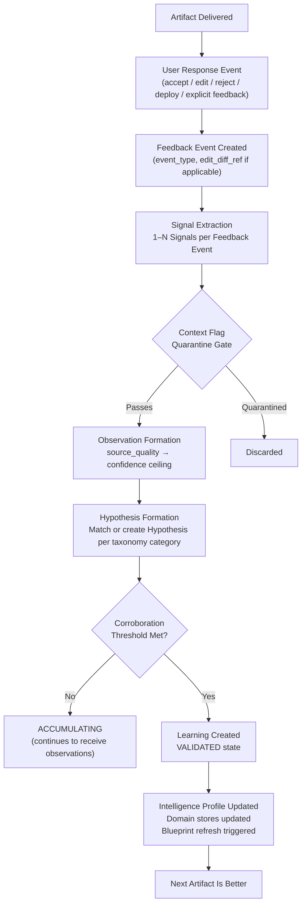

**Participating Entities:** Artifact, Feedback Event, Signal, Observation, Hypothesis, Learning, Intelligence Profile, Artifact Pattern (if pattern updates triggered)

**Flow Participants by Domain:**
- Artifact Intelligence: owns Feedback Event; triggers Artifact Pattern update if editing pattern threshold met
- User Intelligence: receives Style, Preference, Vocabulary, and Framework Learnings
- Project Intelligence: receives Goal and Vocabulary confirmation signals
- Relationship Intelligence: receives Audience Profile calibration signals
- All Domains: receive relevant Learnings via pipeline output

**Terminal State:** Intelligence Profile updated; affected Artifact Patterns reinforced or updated; next generation event for the same artifact type benefits from the signal.

---

## E.3 — Artifact Generation Flow Contract

**Purpose:** Transform a user request into a high-quality, intelligence-calibrated artifact.

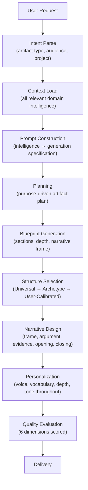

**Entities Participating:** Intelligence Profile, Archetype, Goal, Constraint, Preference, Framework, Vocabulary Model, Knowledge Asset, Project (goals/vocabulary/assets/constraints), Relationship/Audience Profile, Artifact Pattern, Artifact Blueprint, Conflict (resolution), Workspace standards, Artifact (output)

**Authority Sequence during Blueprint Assembly:**
1. Workspace Compliance Constraints loaded (immutable)
2. Project Context loaded (scope override within project)
3. User Intelligence loaded (foundation)
4. Artifact Pattern applied (structure)
5. Relationship/Audience Intelligence applied (calibration)
6. Conflicts detected and resolved (5 Rules)
7. Blueprint finalized (no mid-generation intelligence load)

---

## E.4 — Knowledge Asset Flow Contract

**Purpose:** Convert a User's uploaded proprietary IP into actionable intelligence used across multiple artifact generation events.

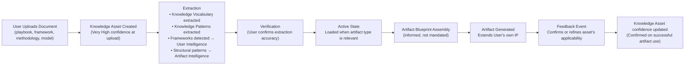

**Participating Domains:** Knowledge Intelligence (primary owner), User Intelligence (receives Framework registrations, vocabulary), Artifact Intelligence (receives structural patterns), Project Intelligence (if asset is project-scoped)

**Key Contract:** Knowledge Assets inform but do not mandate. If a Knowledge Asset recommends a methodology structure that conflicts with the User's preference, User wins (Logical Schema J.3 — Knowledge Asset vs. User Preference conflict type).

**Access Rule Contract:** Before loading a Knowledge Asset into Blueprint assembly, the Knowledge Access Rule (`access_scope`) must be verified:
- `user_only`: load only if requesting User is asset owner
- `project`: load for all Users active on the project
- `workspace`: load for all workspace-enrolled Users

---

## E.5 — Project Intelligence Flow Contract

**Purpose:** Initialize, enrich, and archive a Project's intelligence model so that all artifacts generated within the project are coherent, consistent, and progressively more contextually accurate.

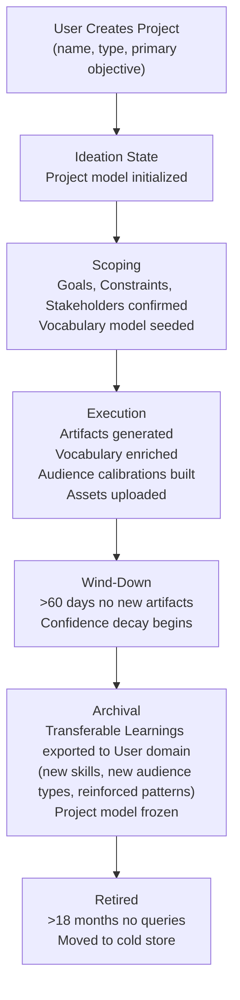

**Transferable Intelligence on Archival (Logical Schema G.4):**

| Intelligence Type | Transfer? | Condition |
|---|---|---|
| Project-specific vocabulary | No | Stays in project archive |
| New skills demonstrated | Yes → Skills Inventory | ≥3 project artifacts demonstrating the skill |
| New audience types encountered | Yes → Audience Intelligence | Audience type not already modeled |
| New Framework used/developed | Yes → Framework + Knowledge Asset | Requires User confirmation |
| Project-specific constraints | No | Stays project-scoped |
| Artifact patterns reinforced | Yes → User-Calibrated Artifact Pattern | Automatically applied by Artifact Intelligence |

---

## E.6 — Relationship Intelligence Flow Contract

**Purpose:** Build and maintain calibration models for specific named recipients, enabling artifact precision that generic audience profiles cannot achieve.

```mermaid
flowchart LR
    M["First Mention of Named Person/Org"] --> PR["Relationship Profile Initialized\n(Provisional confidence)"]
    PR --> SM["Second Mention + Artifact Directed at Them"] --> LW["Low Confidence Profile"]
    LW --> UPD["User Provides Explicit Description\nor Multiple Artifacts Sent"] --> MD["Medium Confidence Profile"]
    MD --> OC["Positive Artifact Outcome Attributed to Calibration"] --> HC["High Confidence Profile"]
    HC --> CF["Confirmed Profile\nFull calibration authority for recipient-facing artifacts"]
    CF --> DC{">90 days no contact?"}
    DC -- "Yes" --> DG["Decay Flag Set\nConfidence Degraded"]
    DC -- "No" --> CF
    DG --> RC{"Relationship\nResumes?"}
    RC -- "Yes" --> HC
    RC -- "No" --> AR["Archived\nNew profile created if relationship resumes in new form"]
```

---

## E.7 — User Correction Flow Contract

**Purpose:** Ensure that an explicit User correction immediately supersedes any prior model and is treated as the highest-authority signal in the system.

```mermaid
flowchart LR
    UC["User Issues Explicit Correction\n(\"That's wrong — I actually prefer X\")"] --> ID["Correction Identified\nby Signal Extractor as\nexplicit_statement source_type"]
    ID --> OV["Correction Override Rule Applied\nImmediately sets corrected Learning\nto CONFIRMED confidence\nBypasses corroboration threshold"] --> SP["Prior Learning ARCHIVED\n(superseded_by_learning_id set)"]
    SP --> UP["Intelligence Profile Updated\nProfile version incremented\nBlueprint refresh triggered"]
    UP --> NEXT["Next generation event\nuses corrected Learning\nimmediately"]
```

**Authority:** This is the only flow in the system that bypasses the normal corroboration-threshold pathway. Correction Override Rule (Logical Schema D.3) is absolute — no other contract may delay or gate a User correction.

---

## E.8 — Intelligence Conflict Flow Contract

**Purpose:** Detect, resolve, and record disagreements between domain intelligence sources during Blueprint assembly, with transparency to the User when significant departures occur.

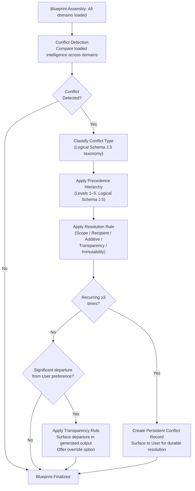

---

# Section F — Intelligence Ownership Contracts

## F.1 — Ownership Model Principle

> **Contract Principle:** Every entity has exactly one System Owner, one Update Owner, one Validation Owner, and one Consumption Authority. Ambiguity in ownership is a correctness risk — it creates pathways for intelligence to be written by components that lack authority, read without the correct precedence rules, or updated without the correct validation gate. This section formalizes ownership for every entity and eliminates all ambiguity. It extends and formalizes Logical Schema Section F (Domain Ownership Model) and Section L.2 (Contract Map).

---

## F.2 — Complete Ownership Contract Table

| Entity | System Owner | Update Owner | Validation Owner | Consumption Authority |
|---|---|---|---|---|
| **User** | User Intelligence | Registration/Onboarding System (initial); User Intelligence (ongoing) | Self-referential root entity — no external validation | All domains (read-only); User Intelligence (write) |
| **Intelligence Profile** | User Intelligence | User Intelligence — Profile Builder (on Learning additions/state changes) | User Intelligence (cross-domain Learning consistency check) | Artifact Blueprint Builder; Artifact Evaluator; Quality Reviewer (read-only) |
| **Archetype** | User Intelligence | Learning Pipeline — Hypothesis Engine (behavioral signals); User (explicit self-identification seeds a Provisional Hypothesis) | User Intelligence (corroboration threshold + behavioral validation) | Intelligence Profile Builder; Artifact Pattern selector; Artifact Blueprint Builder |
| **Goal (User)** | User Intelligence | User (explicit); Learning Pipeline (provisional, inferred) | User Intelligence (time-horizon revalidation) | Artifact Blueprint Builder; Artifact Evaluator; Narrative Planner |
| **Goal (Project)** | Project Intelligence | User (explicit at scoping); Learning Pipeline (provisional) | Project Intelligence (milestone-cycle reconfirmation) | Project Context Builder; Artifact Blueprint Builder |
| **Constraint (User)** | User Intelligence | User (explicit); Learning Pipeline (provisional) | User Intelligence | Artifact Blueprint Builder; Conflict Detection Model |
| **Constraint (Project)** | Project Intelligence | User (explicit at scoping); Learning Pipeline (provisional) | Project Intelligence | Project Context Builder; Artifact Blueprint Builder |
| **Constraint (Compliance)** | Workspace Intelligence | Workspace Admin only | Workspace Intelligence (compliance review) | Artifact Blueprint Builder (final pass, immutable); Quality Reviewer |
| **Preference** | User Intelligence (cross-artifact) / Artifact Intelligence (type-specific) | Learning Pipeline — Learning Validator (from Feedback Events and editing deltas); User (explicit correction = immediate Confirmed) | User Intelligence / Artifact Intelligence per scope | Artifact Blueprint Builder; Audience Calibrator; Narrative Planner; Structure Planner |
| **Framework** | User Intelligence | Learning Pipeline (from behavioral pattern detection); User (explicit correction) | User Intelligence | Narrative Planner; Artifact Blueprint Builder (≥Medium confidence threshold) |
| **Operating Principle** | User Intelligence | User (explicit declaration or correction only); Learning Pipeline (emphatic repeated statements → Provisional) | User Intelligence | Artifact Blueprint Builder (values filter); Artifact Evaluator; Quality Reviewer |
| **Vocabulary Model (User)** | User Intelligence | Learning Pipeline (continuous); Knowledge Intelligence (extraction from Knowledge Assets) | User Intelligence | Artifact Blueprint Builder; Generation System |
| **Vocabulary Model (Project)** | Project Intelligence | Learning Pipeline (project context extraction); User (explicit additions) | Project Intelligence | Project Context Builder; Artifact Blueprint Builder (project-scoped artifacts only) |
| **Vocabulary Model (Workspace)** | Workspace Intelligence | Workspace Admin | Workspace Intelligence | Artifact Blueprint Builder (external artifacts); Quality Reviewer |
| **Knowledge Asset** | Knowledge Intelligence | User (re-upload = new version); Workspace Admin (shared assets); Knowledge Intelligence (version management) | Knowledge Intelligence (extraction verification + User confirmation) | Artifact Blueprint Builder; Narrative Planner; Structure Planner; Knowledge Vocabulary/Pattern consumers |
| **Knowledge Asset Version** | Knowledge Intelligence | Knowledge Intelligence (version management) | Knowledge Intelligence | Artifact Blueprint Builder (current active version only) |
| **Knowledge Vocabulary** | Knowledge Intelligence | Knowledge Intelligence (extracted at upload; updated on version change) | Knowledge Intelligence | Artifact Blueprint Builder; User Intelligence (Framework enrichment) |
| **Knowledge Pattern** | Knowledge Intelligence | Knowledge Intelligence | Knowledge Intelligence | Artifact Intelligence (Artifact Pattern reference); Artifact Blueprint Builder |
| **Relationship** | Relationship Intelligence | Learning Pipeline (second mention + artifact directed); User (explicit description; correction = immediate authority) | Relationship Intelligence (second mention + artifact outcome corroboration) | Audience Calibrator; Artifact Blueprint Builder |
| **Audience Profile (Generic)** | User Intelligence | Learning Pipeline (User-level audience category); User (explicit description) | User Intelligence | Audience Calibrator; Artifact Blueprint Builder (fallback when no specific Relationship profile) |
| **Audience Profile (Specific)** | Relationship Intelligence | Relationship Intelligence (linked 1:1 to Relationship entity); User (explicit description update) | Relationship Intelligence (artifact outcome corroboration) | Audience Calibrator; Artifact Blueprint Builder (supersedes generic profile for named recipient) |
| **Artifact Pattern (Universal)** | Artifact Intelligence | Curation team (at launch); cross-user aggregation system (at scale >10K users) | Curation review; cross-user acceptance data threshold | Artifact Blueprint Builder — Structure Planner (baseline when no higher level exists) |
| **Artifact Pattern (Archetype)** | Artifact Intelligence | Curation team + Learning Pipeline (archetype-level accepted artifacts) | Artifact Intelligence (Archetype Confirmed + sufficient exemplar volume) | Artifact Blueprint Builder — Structure Planner (overrides Universal when Archetype Confirmed) |
| **Artifact Pattern (User-Calibrated)** | Artifact Intelligence | Learning Pipeline — Learning Validator (from this User's Feedback Events and editing patterns) | Artifact Intelligence (≥2 accepted exemplars + rejection_count check) | Artifact Blueprint Builder — Structure Planner (highest priority; overrides Universal and Archetype) |
| **Artifact Blueprint** | Artifact Intelligence (synthesis) | Artifact Intelligence — Blueprint Builder (assembled per generation event; no external writes) | Conflict Resolution Model (all conflicts resolved before Blueprint is finalized) | Generation System (single consumer; Blueprint is finalized before generation begins) |
| **Artifact Exemplar** | Artifact Intelligence | Artifact Intelligence (promoted from Artifact on accepted/deployed event) | Artifact Intelligence (acceptance or deployment Feedback Event is the validation event) | Artifact Blueprint Builder (structural reference); Artifact Pattern reinforcement |
| **Artifact** | Artifact Intelligence / Project Intelligence | Generation System (creation); Feedback Event system (post-delivery updates) | User (response to delivery = Feedback Event) | User (primary recipient); Feedback Event system |
| **Feedback Event** | Artifact Intelligence | User (explicit action or behavioral trace post-delivery) | Event type classification (Artifact Intelligence) | Signal Extractor (immediate); Domain update triggers |
| **Signal** | Learning Pipeline | Signal Extractor (creation and tagging) | Signal Extractor — context-flag quarantine gate | Observation Builder (sole consumer; pipeline-internal) |
| **Observation** | Learning Pipeline | Observation Builder | Source-quality classification gate | Hypothesis Engine (sole consumer; pipeline-internal) |
| **Hypothesis** | Learning Pipeline | Hypothesis Engine (corroboration/contradiction accumulation) | Learning Validator (corroboration threshold + contradiction rules) | Learning Validator (sole consumer; pipeline-internal) |
| **Learning** | Domain of the Learning's subject entity | Learning Pipeline — Learning Validator (state transitions); User (correction = immediate Confirmed) | Per B.3 entity-specific validation contracts | Intelligence Profile Builder; domain stores (all domains read their owned Learnings) |
| **Conflict** | Cross-Domain (Conflict Resolution Model) | Conflict Detection (per Blueprint assembly); Conflict Resolution Model (resolution outcome) | Conflict Resolution Model (rules applied; no single domain owns conflict resolution) | Artifact Blueprint Builder (receives resolution outcome); User (notification per Transparency Rule) |
| **Project** | Project Intelligence | User (explicit creation, lifecycle state transitions, goal/constraint updates) | Project Intelligence (goal/stakeholder confirmation) | Project Context Builder; Artifact Blueprint Builder; Vocabulary Model loader; Constraint set loader |
| **Workspace** | Workspace Intelligence | Workspace Admin only | Workspace Intelligence (admin confirmation; compliance review) | Workspace Context Loader; Artifact Blueprint Builder; Quality Reviewer |

---

## F.3 — Ownership Boundary Enforcement Rules

The following rules prevent ownership boundary violations, derived from Logical Schema Section F.1 and Architecture Section B.1–B (Domain Boundaries):

| Boundary Rule | Description | Prevents |
|---|---|---|
| **User Intelligence Write Boundary** | Only the Learning Pipeline and the User (via explicit correction) may write to User Intelligence domain stores | Project Intelligence cannot insert project-specific vocabulary into the User's permanent model |
| **Project Intelligence Isolation** | Project-scoped Goals, Constraints, and Vocabulary do not migrate to User Intelligence unless explicitly transferred at project archival via the Archival Transfer Contract (Section E.5) | Project constraints corrupting the User's permanent constraint model |
| **Artifact Pattern Write Isolation** | Only Artifact Intelligence may write to Artifact Pattern records — including user-calibrated patterns | User Intelligence cannot directly modify Artifact Patterns; it supplies Learnings that the pipeline converts into Pattern updates |
| **Workspace Compliance Immutability** | No component other than Workspace Admin may create or modify Compliance Constraints | User preferences, project requirements, or pipeline Learnings cannot override compliance constraints |
| **Knowledge Asset Access Scope** | Knowledge Assets with `access_scope: user_only` must never be loaded into Blueprint assembly for any User other than the owner | Cross-user IP leakage prevention |
| **Relationship Intelligence Specificity Boundary** | Named Relationship profiles belong exclusively to Relationship Intelligence; generic audience types belong to User Intelligence | Generic audience type calibration must not be stored as a named Relationship; named Relationship intelligence must not be generalized to a generic audience type |
| **Blueprint Write Exclusivity** | Only Artifact Intelligence — Blueprint Builder may write the Artifact Blueprint | No domain may insert intelligence directly into a Blueprint without going through the Blueprint Builder's conflict resolution and assembly process |
| **Permanent-Class Write Protection** | Permanent-stability-class Learnings may not be transitioned to DECAYING or ARCHIVED by any automated process | Only explicit User action or strong contradictory evidence (High+, 2+ independent sources) may change permanent-class Learnings |

---

# Section G — Artifact Generation Contract

## G.1 — Artifact Generation Contract Principle

> **Contract Principle:** Every artifact generation event is a formal contract with defined inputs, processing stages, intelligence consulted, decisions made, outputs, and feedback collection obligations. This contract is the bridge between intelligence accumulation and value delivery. Without a generation contract, intelligence exists but never compounds. This section formalizes the complete generation contract and defines the contract for every canonical artifact type.

---

## G.2 — Universal Artifact Generation Contract

This contract applies to every artifact generation event, regardless of type.

### Inputs

| Input Category | Entities | Required / Optional |
|---|---|---|
| User request | Intent (artifact type, topic, audience, project context) | Required |
| Intelligence Profile | Voice model, Expertise model, Goal model, Constraint model, Preference set, Framework set | Required — must exist before generation permitted |
| Archetype | Primary + secondary archetypes (weighted) | Required at ≥Low confidence |
| Artifact Pattern | Universal → Archetype → User-Calibrated (highest available level) | Required — Universal is always available as baseline |
| Project context | Goals, Vocabulary, Stakeholders, Assets, Lifecycle state | Required if artifact is project-scoped; optional otherwise |
| Audience/Relationship Profile | Generic Audience Profile or specific Relationship Profile | Required (at minimum, generic type) |
| Knowledge Assets | Relevant uploaded IP | Optional (loaded if applicable) |
| Workspace Standards | Vocabulary, formatting, compliance constraints | Required for workspace-enrolled Users |

### Processing Stages

See Section D.2 (13-step General Composition Contract) for the ordered stage sequence. Each stage has a defined primary domain participant and output artifact, per Architecture Section H.2.

### Intelligence Consulted

| Stage | Intelligence Consulted | Decision Made |
|---|---|---|
| Intent Parse | None (input interpretation only) | Artifact type classification; audience identification; project context binding |
| Context Load | All relevant domain stores | Which intelligence is in scope for this artifact type and context |
| Prompt Construction | Intelligence Profile + Project + Audience + Workspace | Generate a precise, intelligence-enriched specification (not a generic instruction) |
| Planning | Project Intelligence + User Goals + Relationship Intelligence + Artifact Pattern | Purpose-driven artifact plan: what must this artifact enable the recipient to believe, feel, or decide? |
| Blueprint Generation | Artifact Pattern + Project + User Preferences | Structural skeleton: sections, subsections, depth, narrative frame, opening pattern, closing pattern |
| Structure Selection | Artifact Pattern (three-level hierarchy) | Which structural form: Universal, Archetype, or User-Calibrated |
| Narrative Design | User Frameworks + Artifact Pattern + Relationship Intelligence + Project | Narrative frame; argument structure; evidence strategy; opening hook; closing approach |
| Personalization | Full Intelligence Profile + Vocabulary Model + Knowledge Assets | Apply voice, depth, vocabulary, and framing throughout generation |
| Quality Evaluation | All domains (as scoring criteria) | Score across 6 quality dimensions; flag dimensions below threshold |

### Outputs

| Output | Entity Created | Condition |
|---|---|---|
| Artifact | `Artifact` record | Always — primary output of generation |
| Artifact Blueprint | `Artifact Blueprint` record | Always — retained for audit and potential Exemplar promotion |
| Quality Score | 6-dimension score (attached to Artifact) | Always |
| Conflict Records | `Conflict` records | Only when conflicts were detected and resolved |
| User Notification | Transparency surfacing in delivered output | Only when significant departure from preference occurred |

### Quality Evaluation Dimensions

Derived from Architecture Section H.2, Stage 8:

| Quality Dimension | Evaluated Against | Minimum Threshold |
|---|---|---|
| Structural accuracy | Artifact Pattern (pattern match score) | Artifact Pattern confidence level |
| Contextual relevance | Project Intelligence (current state alignment) | Active Goals must be served |
| Voice authenticity | User Intelligence (style match) | Preference confidence level for this artifact type |
| Audience calibration | Relationship Intelligence (recipient fit) | Relationship profile confidence level |
| Organizational compliance | Workspace Intelligence (standards adherence) | 100% — compliance is immutable |
| Goal alignment | User + Project Intelligence (purpose match) | At least one active Goal must be served |

**Below-threshold handling:** Low-scoring dimensions trigger targeted revision before delivery. If compliance dimension scores below 100%, generation halts and compliance correction is applied unconditionally.

### Feedback Collection Contract

After delivery, the following feedback collection obligations apply:

| Feedback Type | Required / Optional | How Captured | Processing |
|---|---|---|---|
| Accept (no edit) | Captured as behavioral signal | User closes/dismisses artifact without edit | High-weight positive Feedback Event |
| Accept with edits | Required capture if edits occur | Edit diff recorded in `edit_diff_ref` | Delta Learning Protocol applied (5 delta types: structural, length, vocabulary, tone, substance) |
| Explicit rejection | Captured as explicit signal | User explicitly declines artifact | Negative Feedback Event; decrement confidence on contributing parameters |
| Explicit praise | Captured as explicit signal | User explicitly rates or comments positively | Positive reinforcement signal; Exemplar promotion candidate |
| Deployment | Highest-value signal | User sends/publishes artifact externally | Artifact Exemplar promotion; maximum reinforcement signal |
| Abandonment | Low-value signal | Session ends without artifact use | Logged; single instance insufficient for model recalibration |

### Learning Updates

After Feedback Event processing, the following Learning updates are triggered:

| Signal Type | Learning Update Triggered |
|---|---|
| Accept without edit | Reinforce all contributing Artifact Pattern parameters; reinforce Preference Learnings in scope |
| Accept with edit (structural delta) | Update Artifact Pattern section structure for this User if ≥3 consistent structural edits |
| Accept with edit (length delta) | Update length baseline Preference for this artifact type and context |
| Accept with edit (vocabulary delta) | Add edited vocabulary to User Vocabulary Model; remove replaced terms |
| Accept with edit (tone delta) | Update tone Preference for this artifact type and context |
| Accept with edit (substance delta) | Update Project Intelligence if substance changes reflect project context gaps |
| Rejected with reason | Flag Artifact Pattern parameters implicated in rejection; decrement confidence; add to `known_rejection_triggers[]` |
| Deployed | Promote Artifact to Exemplar; maximum reinforcement on all contributing parameters; archive as gold-standard reference |

---

## G.3 — Artifact-Type-Specific Generation Contracts

For each artifact type, the following summarizes the specific intelligence decisions made, derived from the composition models in Section D:

| Artifact Type | Structure Decision Contract | Audience Decision Contract | Voice Decision Contract | Depth Decision Contract |
|---|---|---|---|---|
| **Board Update** | Artifact Pattern (Board Update, User-Calibrated if available) → Sections: Exec Summary, Progress vs Plan, Key Metrics, Risks, Asks | Board Relationship Profile (if available) → board expertise level, known sensitivities, required detail level; else generic Board Audience Profile | User executive register; Founder/CEO confidence vocabulary | Project state determines depth of financial and operational sections |
| **Investor Update** | Artifact Pattern (Investor Update) → Sections: Headline, Metrics, Progress, Challenges, Ask | Specific Investor Relationship Profile (highest priority); investor thesis alignment, known concerns, preferred evidence type | User's authentic founder/CEO voice within investor calibration | Current company stage and metrics determine depth; investor's known preferences calibrate level of detail |
| **Strategy Document** | Artifact Pattern (Strategy) → Context/Insight/Options/Recommendation/Next Steps | Internal vs. external calibration from Relationship Intelligence | User's analytical register and framework vocabulary | Expertise level + project requirements determine option depth (Additive Rule if conflict) |
| **Architecture Proposal** | Artifact Pattern (Architecture) → Problem/Requirements/Design/Trade-offs/Recommendation | Technical sophistication of reviewer (Relationship Intelligence) calibrates vocabulary accessibility | User's technical register; engineering vocabulary from Skills Inventory | Full depth for technical audiences; accessible for executive audiences (Recipient Rule) |
| **Research Paper** | Artifact Pattern (Research Paper) → Abstract/Background/Method/Findings/Discussion/Conclusion | Publication/journal audience expectations if known; peer reviewer profile if available | Academic register; domain-specific citation style | Expert depth throughout; no scaffolding; methodology rigor expected |
| **Product Roadmap** | Artifact Pattern (Product Roadmap) → Vision/Themes/Phases/Milestones/Dependencies | Audience version (investor / engineering team / customer) drives full recalibration | Product Manager vocabulary; strategic planning register | Audience version determines granularity (investor = strategic, engineering = operational) |
| **LinkedIn Post** | Artifact Pattern (LinkedIn Post) → Hook/Insight/Evidence-Story/CTA | General professional network; known follower calibration if available | Personal brand voice (dominant signal); conversational but professional | Short-form; maximum density; every word earns its place |

---

# Section H — Quality Improvement Contracts

## H.1 — Quality Improvement Principle

> **Contract Principle:** BrandOS does not improve through passive observation — it improves through formal contracts that define exactly how each type of user response translates into specific model updates. This section defines the formal quality improvement contract for every recognized artifact outcome type. Each contract specifies the improvement pathway, the entities updated, and the compounding mechanism that makes future artifacts better. Derived from Taxonomy Sections E and F, Architecture Section D.4, and Logical Schema Section H.4.

---

## H.2 — Quality Improvement Contract: Accepted Artifact (No Edits)

**Trigger:** User receives artifact and accepts it without making any edits.

**Signal Value:** High — confirms the current model is well-calibrated for this artifact type and context.

| Update Target | Update Action | Confidence Impact |
|---|---|---|
| Artifact Pattern (this type, User-Calibrated) | Reinforce all structural elements (sections, ordering, depth) | +confidence per corroboration; highest toward Confirmed at 10+ accepted exemplars |
| Preferences in scope | Reinforce length, tone, format, vocabulary Preferences that were applied in this artifact | +corroboration count on each applied Preference |
| Goal alignment | Confirm that the artifact served the active Goals it was designed to serve | +corroboration count on Goal entities |
| Archetype calibration | Confirm that the archetype's default calibrations were appropriate | +corroboration count on primary Archetype |
| Audience Profile (if applicable) | Confirm that the audience calibration was accurate | +confidence on Audience Profile / Relationship Profile |
| Exemplar promotion candidate | Flag artifact as Exemplar candidate (not yet promoted — requires deployment for auto-promotion) | Candidate status logged |

**Compounding Effect:** After 2+ accepted artifacts of the same type, a User-Calibrated Artifact Pattern begins forming. After 10+ consistently accepted artifacts, the pattern reaches Confirmed confidence — at which point the User's structural preferences drive generation with maximum authority.

---

## H.3 — Quality Improvement Contract: Edited Artifact

**Trigger:** User accepts the artifact but applies edits before use.

**Signal Value:** Very High — the delta between generated and accepted content is a direct model calibration signal.

**Delta Learning Protocol (5 Dimensions, derived from Taxonomy Section E.2):**

| Delta Type | Detected How | Update Triggered | Minimum Evidence |
|---|---|---|---|
| **Structural Delta** | User changed sections, ordering, or hierarchy | Update Artifact Pattern section structure for this User | ≥3 consistent structural edits of the same type |
| **Length Delta** | User made artifact significantly longer or shorter | Update length baseline Preference for this artifact type and context scope | ≥2 consistent length direction changes |
| **Vocabulary Delta** | User replaced specific words or phrases | Add edited vocabulary to User Vocabulary Model; flag replaced terms as rejection vocabulary | 1 instance (high-specificity signal); confirm after 2nd |
| **Tone Delta** | User shifted register (more formal, more casual, more authoritative) | Update tone Preference for this artifact type and context | ≥2 consistent tone direction changes |
| **Substance Delta** | User added, removed, or changed substantive content | Update Project Intelligence if substance changes reflect project context gaps; update Knowledge Asset awareness if user added proprietary content | 1 instance for project context; 3 for structural model change |

**Compound Update Rule:** If the same section is edited in the same way across ≥3 accepted artifacts of the same type, that edit is incorporated directly into the User-Calibrated Artifact Pattern as a structural default — not merely as a Preference.

---

## H.4 — Quality Improvement Contract: Rejected Artifact

**Trigger:** User explicitly rejects the artifact or abandons the generation event without use.

**Signal Value:** Very High for explicit rejection with reason; Low for abandonment without context.

| Action | Update Triggered | Condition |
|---|---|---|
| Flag implicated parameters | Decrement confidence on Artifact Pattern parameters that contributed to the rejection | Always — single rejection flags, does not immediately modify |
| Add to rejection triggers | Log the rejection pattern in `known_rejection_triggers[]` on the Artifact Pattern | Always |
| No immediate model recalibration | A single rejection does not trigger pattern change | Always — per Taxonomy Section H, negative reactions may reflect a bad session, not a model error |
| Second rejection (same dimension) | Trigger model review event for that dimension; request explicit feedback if possible | 2+ consistent negative signals on the same dimension |
| Explicit rejection with reason | Immediately extract the specific reason as a high-confidence Signal; process through pipeline with elevated weight | When reason is provided |
| Competing hypothesis | If rejection contradicts a Confirmed Preference, create a competing Hypothesis in the CHALLENGED state | When rejection signal contradicts existing Confirmed Learning |

**Protection Contract:** A single negative signal must not trigger immediate recalibration. This protects against model corruption from session-context rejections (user was in a rush, external requirement drove the rejection) that do not represent stable model errors (Taxonomy Section H — Dangerous or Low-Value Learning).

---

## H.5 — Quality Improvement Contract: Deployed Artifact

**Trigger:** User sends, publishes, or submits the artifact externally without modification.

**Signal Value:** Very High — the highest available quality signal. An artifact deployed to a real audience is deployment-ready.

| Update Target | Update Action | Confidence Impact |
|---|---|---|
| Artifact Exemplar promotion | Artifact is automatically promoted to Exemplar status | Permanent reference; never deleted |
| Artifact Pattern (this type) | Maximum reinforcement signal on all structural, depth, length, and narrative parameters | Strongest available positive reinforcement; accelerates toward Confirmed |
| All contributing Preferences | Maximum reinforcement on voice, tone, vocabulary, format Preferences applied in this artifact | +very high corroboration weight |
| Archetype model | Strong confirmation that archetype calibration was accurate for this deployment context | +High corroboration to primary Archetype |
| Audience/Relationship Profile | Strong confirmation that audience calibration was accurate | +High corroboration to applicable profile |
| Intelligence Profile | Composite confidence score increases for all dimensions that contributed | Profile rebuild triggered on significant composite change |

**Compounding Effect:** A deployed artifact is the single richest learning event in the system. Ten deployed board updates produce a board-update pattern calibrated to this User's actual professional standard — not to a generic template.

---

## H.6 — Quality Improvement Contract: Exemplar Artifact

**Trigger:** An artifact reaches Exemplar status (deployed, or explicitly praised and designated by User as exemplary).

**Signal Value:** Permanent structural reference.

| Contract Obligation | Description |
|---|---|
| Never deleted | Exemplars are retained permanently, even when superseded by newer Exemplars |
| Available for Blueprint reference | All future Blueprint Assembly events for the same artifact type may reference this Exemplar as a structural model |
| Available for Pattern reinforcement | Exemplars are the primary corroboration source for User-Calibrated Artifact Pattern confidence growth |
| Audit accessibility | Exemplars are queryable by the User for reference; they are not loaded automatically unless the Blueprint Builder determines they are structurally relevant |
| Supersession rules | A newer Exemplar does not delete the prior one; it becomes the primary reference while the older Exemplar is retained as secondary reference |

---

## H.7 — Quality Improvement Compounding Timeline

Derived from Architecture Section J.3 and Logical Schema Section H.5:

| Maturation Phase | Duration | Primary Learning Source | Artifact Quality Expectation |
|---|---|---|---|
| **Calibration Phase** | Sessions 1–12 (approx. 0–3 months) | Rapid Hypothesis formation; wide confidence bands; high update frequency per session | Meaningfully better than generic from Session 1; frequent model updates |
| **Stabilization Phase** | Month 3–12 | Core model confirmed across key dimensions; slower growth with refinement; narrowing confidence intervals | Significantly personalized; minimal style mismatch; structural preferences well-modeled |
| **Compounding Phase** | Year 1–3 | Stable core model; nuanced refinement; Project and Relationship models deeply developed | Ghost-writing quality for common artifact types; system anticipates structure before User specifies |
| **Institutional Phase** | Year 3+ | BrandOS has modeled the User more comprehensively than any individual tool or colleague | Artifact quality indistinguishable from User's own best work; anticipatory generation active |

---

# Section I — Conceptual Runtime Components

## I.1 — Runtime Architecture Principle

> **Contract Principle:** The intelligence contracts defined in Sections A–H require named runtime components to execute them. This section defines those components at the conceptual level — their purpose, inputs, outputs, and dependencies — without reference to implementation technology, databases, APIs, or infrastructure. Each component is the conceptual locus of responsibility for one or more contracts. Components correspond to the logical responsibilities implied by the approved Logical Schema (Section L.2) and Architecture (Section H.2).

---

## I.2 — Runtime Component Architecture

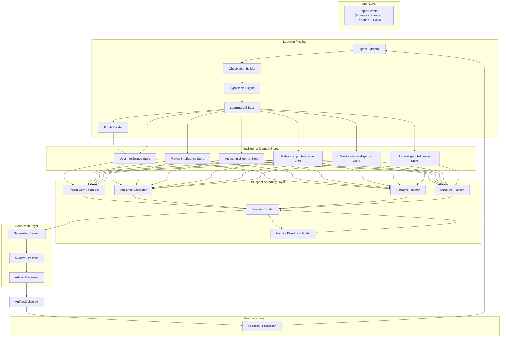

---

## I.3 — Component Definitions

### Signal Extractor

| Attribute | Definition |
|---|---|
| **Responsibility** | Extract raw Signals from every input event. Apply the context-flag quarantine gate. Tag with `source_type` and initial `context_flags`. Route validated Signals to Observation Builder; discard quarantined Signals unless explicit persistent-identity override applies. |
| **Inputs** | Any input event: User prompt, uploaded document, Feedback Event, edit action, explicit statement, behavioral trace |
| **Outputs** | Validated `Signal` records (to Observation Builder); quarantine log (discarded Signals) |
| **Dependencies** | Feedback Processor (upstream); context-flag classification rules (Taxonomy Section H) |
| **Contract Owner** | Learning Pipeline |

---

### Observation Builder

| Attribute | Definition |
|---|---|
| **Responsibility** | Transform validated Signals into structured Observations by attaching taxonomy category, context metadata, source-quality classification, and initial confidence estimate. Enforce the Ceiling Rule: source quality sets the confidence ceiling for this Observation. |
| **Inputs** | Validated `Signal` records |
| **Outputs** | `Observation` records with `source_quality`, `initial_confidence_estimate`, `taxonomy_category`, and `context` populated |
| **Dependencies** | Signal Extractor (upstream); Taxonomy category map; source-quality classification rules (Logical Schema B.10) |
| **Contract Owner** | Learning Pipeline |

---

### Hypothesis Engine

| Attribute | Definition |
|---|---|
| **Responsibility** | Match each Observation to an existing Hypothesis (corroboration/contradiction) or create a new Hypothesis. Maintain state transitions between `PROVISIONAL`, `ACCUMULATING`, and `CHALLENGED`. Enforce the Contradiction Rule (50% confidence reduction on first high-quality contradiction). Detect competing Hypotheses in the same category. Enforce 30-day timeout for non-permanent categories. |
| **Inputs** | `Observation` records; existing `Hypothesis` records (read from pipeline store) |
| **Outputs** | Updated `Hypothesis` records (state and confidence); new `Hypothesis` records |
| **Dependencies** | Observation Builder (upstream); Stability-class corroboration threshold table (Logical Schema D.1 Stage 3); Contradiction Rule; Timeout enforcement |
| **Contract Owner** | Learning Pipeline |

---

### Learning Validator

| Attribute | Definition |
|---|---|
| **Responsibility** | Promote Hypotheses that have met their corroboration threshold with no unresolved high-quality contradictions to `Learning` status. Assign `stability_class`, `decay_rate`, and `context_scope`. Detect and escalate Hypotheses with ≥2 high-quality contradictions for User resolution. Enforce the Correction Override Rule for explicit User corrections. |
| **Inputs** | `Hypothesis` records in `ACCUMULATING` or `CHALLENGED` state; explicit User correction events |
| **Outputs** | `Learning` records in state `VALIDATED`; escalation signals for User review cases |
| **Dependencies** | Hypothesis Engine (upstream); Stability-class threshold rules; Correction Override Rule |
| **Contract Owner** | Learning Pipeline |

---

### Profile Builder

| Attribute | Definition |
|---|---|
| **Responsibility** | Assemble and version the consolidated Intelligence Profile from all active Learnings, weighted by the Taxonomy's impact-priority hierarchy. Trigger Profile rebuild when >3 high-confidence Learnings are added or when a permanent-class Learning changes. Flag Profiles that have not been validated against new Learnings in >60 days. Trigger Blueprint refresh for affected artifact types after Profile updates. |
| **Inputs** | `Learning` records (all state changes); prior `Intelligence Profile` version |
| **Outputs** | Updated/versioned `Intelligence Profile`; Blueprint refresh triggers for affected artifact types |
| **Dependencies** | Learning Validator (upstream); Taxonomy impact-priority hierarchy (Taxonomy Section G); composite confidence scoring rules |
| **Contract Owner** | User Intelligence |

---

### Project Context Builder

| Attribute | Definition |
|---|---|
| **Responsibility** | Load and assemble the active Project's intelligence package when an artifact generation event occurs in a project context. Provides: Project Goals, Constraints, Vocabulary, Stakeholder map, Project Assets, Lifecycle state, and prior artifact history within the project. |
| **Inputs** | Active `Project` record; `Goal (Project)` records; `Constraint (Project)` records; `Vocabulary Model (Project)`; `Knowledge Asset` (project-scoped); Project artifact history |
| **Outputs** | Project context package (consumed by Blueprint Builder) |
| **Dependencies** | Project Intelligence domain store; Project lifecycle state check (only active projects contribute to real-time generation) |
| **Contract Owner** | Project Intelligence |

---

### Audience Calibrator

| Attribute | Definition |
|---|---|
| **Responsibility** | Determine the appropriate audience calibration for the artifact. Check whether a named Relationship profile exists at sufficient confidence (≥Medium). If yes, load the specific `Audience Profile (Specific)`. If no, load the relevant `Audience Profile (Generic)` from User Intelligence. Apply the Recipient Rule when audience requirements conflict with User style preferences. |
| **Inputs** | Artifact request context (named recipient or audience type); `Relationship` records; `Audience Profile` records (specific and generic) |
| **Outputs** | Audience calibration package (recipient expertise level, communication norms, expected depth, vocabulary register, known concerns) |
| **Dependencies** | Relationship Intelligence domain store; User Intelligence domain store (generic profiles); Confidence thresholds for Relationship records |
| **Contract Owner** | Relationship Intelligence / User Intelligence (shared per domain ownership rules) |

---

### Narrative Planner

| Attribute | Definition |
|---|---|
| **Responsibility** | Select the narrative frame, argument structure, evidence strategy, opening hook, and closing approach for the artifact. Consults: User's preferred narrative frame (User Intelligence), the Artifact Pattern's proven narrative model, the recipient's preferred argument structure (Relationship Intelligence), and the project story at its current stage (Project Intelligence). |
| **Inputs** | User Intelligence (narrative frame Preferences, Framework set); Artifact Pattern (narrative model); Relationship Intelligence (recipient argument preference); Project Intelligence (current project narrative) |
| **Outputs** | Narrative design specification (frame, argument structure, evidence strategy, opening, closing) |
| **Dependencies** | All four primary domains consulted in the Section D.3–D.9 composition sequence |
| **Contract Owner** | Artifact Intelligence (synthesis) — inputs from User, Project, and Relationship Intelligence |

---

### Structure Planner

| Attribute | Definition |
|---|---|
| **Responsibility** | Select the artifact's structural form using the three-level Pattern hierarchy: check for User-Calibrated pattern (≥2 exemplars), then Archetype pattern (Archetype Confirmed), then Universal baseline. Apply User Preference modifications within canonical sections (Additive Rule). Incorporate Exemplar structural references when available. |
| **Inputs** | Artifact Pattern (Universal, Archetype, User-Calibrated — all three loaded, highest available applied); `Artifact Exemplar` records (structural reference); User Preference set (format, structure, visual pattern) |
| **Outputs** | Structural specification (sections, ordering, depth per section, hierarchy, opening and closing pattern) |
| **Dependencies** | Artifact Intelligence domain store (Pattern and Exemplar records); User Intelligence (Preferences); Archetype confidence check |
| **Contract Owner** | Artifact Intelligence |

---

### Blueprint Builder

| Attribute | Definition |
|---|---|
| **Responsibility** | The central synthesis component. Receives all domain intelligence packages and assembles the complete `Artifact Blueprint`. Executes the 13-step generation composition sequence (Section D.2). Invokes Conflict Resolution Model as a required sub-step. Finalizes the Blueprint before handing off to the Generation System. No intelligence may be loaded mid-generation after Blueprint finalization. |
| **Inputs** | Workspace context package; Project context package; Intelligence Profile (User); Artifact Pattern (from Structure Planner); Audience calibration (from Audience Calibrator); Narrative design (from Narrative Planner); Knowledge Asset references; Preference set |
| **Outputs** | Finalized `Artifact Blueprint` (sections, subsections, depth, narrative frame, opening, closing, vocabulary directives, audience calibration, compliance requirements) |
| **Dependencies** | All domain stores (read); Conflict Resolution Model (mandatory sub-step); Blueprint write exclusivity rule (no other component may write to Blueprint) |
| **Contract Owner** | Artifact Intelligence |

---

### Conflict Resolution Model

| Attribute | Definition |
|---|---|
| **Responsibility** | Detect conflicts between loaded domain intelligence sources during Blueprint assembly. Classify each conflict using the Logical Schema J.3 taxonomy. Apply the appropriate resolution rule (Scope / Recipient / Additive / Transparency / Immutability). Record resolved Conflicts. Track recurrence. Escalate recurring Conflicts (≥3) to persistent Conflict Records for User resolution. Surface significant departures per the Transparency Rule. |
| **Inputs** | All loaded domain intelligence packages (from Blueprint Builder); Conflict precedence hierarchy (Levels 1–5); prior Conflict records (for recurrence detection) |
| **Outputs** | Conflict resolution outcomes (written to Blueprint); `Conflict` records; User notification content (when Transparency Rule applies) |
| **Dependencies** | Blueprint Builder (embedded as mandatory sub-step); all domain stores (to classify authority levels); Precedence hierarchy |
| **Contract Owner** | Cross-domain (no single domain ownership) |

---

### Generation System

| Attribute | Definition |
|---|---|
| **Responsibility** | Produce the artifact from the finalized Blueprint. Apply intelligence directives throughout generation (not as a post-processing pass). Voice, vocabulary, depth, structure, and narrative decisions are all resolved in the Blueprint; the Generation System executes them. Create the `Artifact` record upon completion. |
| **Inputs** | Finalized `Artifact Blueprint` (sole input — no mid-generation intelligence loads) |
| **Outputs** | `Artifact` record (delivered to User); `Artifact Blueprint` retained for audit |
| **Dependencies** | Blueprint Builder (upstream; Blueprint must be finalized before generation begins) |
| **Contract Owner** | Artifact Intelligence / Generation layer |

---

### Quality Reviewer

| Attribute | Definition |
|---|---|
| **Responsibility** | Evaluate the generated artifact against intelligence-derived quality criteria before delivery. Score across six dimensions. Flag dimensions below threshold. Halt delivery and trigger revision if compliance dimension scores below 100%. Surface quality score for audit and Learning purposes. |
| **Inputs** | Generated `Artifact`; Artifact Pattern (structural accuracy reference); Project Intelligence (contextual relevance criteria); Intelligence Profile (voice authenticity criteria); Audience/Relationship Profile (audience calibration criteria); Workspace standards (compliance criteria) |
| **Outputs** | 6-dimension quality score; revision directives (if below-threshold dimensions detected); delivery clearance signal |
| **Dependencies** | Generation System (upstream); all domain stores (as scoring criteria sources) |
| **Contract Owner** | Artifact Intelligence |

---

### Artifact Evaluator

| Attribute | Definition |
|---|---|
| **Responsibility** | Post-delivery component. Capture and classify the User's Feedback Event. Determine which intelligence domains are implicated by the feedback. Route feedback for Signal extraction via the Feedback Processor. Track Exemplar promotion eligibility (deployed or explicitly praised artifacts). Detect editing patterns that meet the threshold for Pattern updates. |
| **Inputs** | Delivered `Artifact`; User response (accept / edit / reject / deploy / explicit feedback); edit diff (if edited) |
| **Outputs** | `Feedback Event` record; Exemplar promotion candidate flag; Pattern update triggers (if editing threshold met); Signal generation triggers |
| **Dependencies** | Quality Reviewer (upstream — Artifact must be delivered before evaluation begins); Feedback Processor (downstream) |
| **Contract Owner** | Artifact Intelligence |

---

### Feedback Processor

| Attribute | Definition |
|---|---|
| **Responsibility** | Convert Feedback Events into Signals and route them into the Learning Pipeline. Apply the Delta Learning Protocol for edited artifacts (5 delta types). Enforce the two-rejection minimum rule before model recalibration on any given dimension. Escalate high-frequency negative signals on the same dimension to model review events. |
| **Inputs** | `Feedback Event` records; edit diffs; explicit feedback text |
| **Outputs** | `Signal` records routed to Signal Extractor; model review escalation triggers (when 2+ consistent negative signals on same dimension) |
| **Dependencies** | Artifact Evaluator (upstream); Signal Extractor (downstream) |
| **Contract Owner** | Learning Pipeline |

---

## I.4 — Component Dependency Map

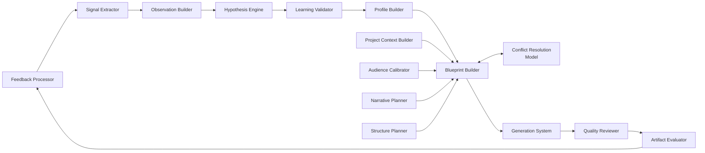

---

# Section J — Phase-Based Implementation Recommendation

## J.1 — Implementation Principle

> **Contract Principle:** Implementation must be sequenced so that every Phase 1 contract is fully operational before any Phase 2 contract is introduced. The minimum Phase 1 contract set is not the simplest possible set — it is the smallest set that produces a *meaningful and defensible quality advantage* while leaving the architecture extensible without rework. This section derives the phased contract set from Logical Schema Section K, Architecture Section K, and Taxonomy Section I.

---

## J.2 — Phase 1 Contracts (GTM-Ready — Mandatory)

These contracts must be operational before launch. They implement the 9 Phase 1 entity types (Logical Schema K.2) and produce all six GTM quality lifts (Logical Schema K.5).

### Phase 1 Required Runtime Components

| Component | Phase 1 Minimum | Full Capability Deferred To |
|---|---|---|
| Signal Extractor | Required — context-flag gate + all source types | Behavioral trace depth extended in Phase 2 |
| Observation Builder | Required — all 4 source-quality levels | No deferral |
| Hypothesis Engine | Required — simplified (provisional/accumulating/discarded only) | Full state machine (CHALLENGED, FLAGGED, COMPETED) in Phase 2 |
| Learning Validator | Required — threshold promotion + Correction Override | Full escalation logic for competing Hypotheses in Phase 2 |
| Profile Builder | Required — core dimensions only (Voice, Goal, Expertise, Constraints, Preferences) | Full dimension coverage in Phase 2 |
| Project Context Builder | Required when User declares a project | Full Project lifecycle state machine in Phase 2 |
| Audience Calibrator | Required — generic Audience Profiles from User Intelligence | Named Relationship profiles (specific) in Phase 2 |
| Narrative Planner | Required — from User Frameworks + Artifact Pattern | Full Relationship Intelligence narrative inputs in Phase 2 |
| Structure Planner | Required — Universal → User-Calibrated selection | Archetype-level patterns in Phase 2 |
| Blueprint Builder | Required | No deferral — central assembly is always required |
| Conflict Resolution Model | Required — all 5 rules must be implemented | Persistent Conflict Records for recurring conflicts in Phase 2 |
| Generation System | Required | No deferral |
| Quality Reviewer | Required — all 6 dimensions | No deferral |
| Artifact Evaluator | Required | No deferral |
| Feedback Processor | Required — all Feedback Event types + Delta Learning Protocol | No deferral |

### Phase 1 Contracts by Section

| Section | Phase 1 Contracts Required |
|---|---|
| **A (Producer)** | Signal, Observation, Hypothesis, Learning, Intelligence Profile (core), Archetype (primary only), Goal (User), Constraint (User + Workspace), Preference, Knowledge Asset (user-upload), Artifact Pattern (Universal), Artifact Pattern (User-Calibrated), Artifact Blueprint, Artifact, Feedback Event, Project (if used) |
| **B (Validation)** | Signal→Observation gate; Observation→Hypothesis gate; Hypothesis→Learning promotion; Learning→Profile update; Archetype (simplified); Goal (User); Constraint; Preference; Knowledge Asset; Artifact Pattern (User-Calibrated); User Correction Override |
| **C (Consumer)** | Signal, Observation, Hypothesis, Learning, Intelligence Profile, Goal (User), Constraint, Preference, Knowledge Asset, Artifact Pattern (Universal + User-Calibrated), Artifact Blueprint, Artifact, Feedback Event, Project (if used) |
| **E (Flows)** | Feedback Flow; Artifact Generation Flow; Knowledge Asset Flow; User Correction Flow; Conflict Detection Flow |
| **F (Ownership)** | All Phase 1 entities must have System Owner, Update Owner, Validation Owner, Consumption Authority defined — even if component is simplified |
| **G (Generation)** | Universal Artifact Generation Contract fully operational; artifact-type-specific contracts for top 5–7 artifact types |
| **H (Quality)** | Accepted, Edited, Rejected, Deployed, Exemplar contracts — all required from Phase 1 |
| **I (Runtime)** | All 15 runtime components operational at Phase 1 minimum capability |

### Phase 1 Simplifications Permitted

Per Logical Schema K.2: "What Phase 1 Does NOT Require":

| Full Contract | Phase 1 Simplification Permitted |
|---|---|
| Formal Hypothesis state machine (10 states) | Simplified 3-state model: Provisional → Accumulating → Promoted/Discarded |
| Formal Conflict Records (persistent) | Apply resolution rules; create Conflict records only for escalations; recurring detection in Phase 2 |
| Named Relationship profiles | Generic Audience Profiles from User Intelligence serve as substitutes |
| Workspace multi-user intelligence | Single-user workspace only; team workspace in Phase 2 |
| Knowledge Intelligence formal domain governance | Knowledge Assets tracked; formal domain and multi-scope governance in Phase 2 |
| Archetype-level Artifact Patterns | Universal + User-Calibrated only; Archetype-level patterns in Phase 2 when sufficient user volume |
| Operating Principles (formal) | May be captured as near-permanent Preferences at Phase 1; formal entity in Phase 2 |
| Framework entity (formal) | May be captured as vocabulary signals at Phase 1; formal entity in Phase 2 |

---

## J.3 — Phase 2 Contracts (High-Value Extensions)

Activated after Phase 1 is fully operational and stable. Each activation has a defined trigger condition per Logical Schema K.3.

| Contract / Component | Capability Added | Activation Trigger |
|---|---|---|
| **Relationship Intelligence** (full) | Named Relationship profiles; specific Audience Profiles; Recipient Rule full power | User generates ≥3 external artifacts; named recipients appear consistently |
| **Audience Profile (Specific)** | Named-recipient calibration supersedes generic profiles | On Relationship creation and first artifact directed at the relationship |
| **Artifact Pattern (Archetype-level)** | Archetype-specific structural baselines between Universal and User-Calibrated | Archetype confidence is Confirmed + sufficient accepted artifact volume |
| **Hypothesis Engine (full state machine)** | CHALLENGED, FLAGGED, COMPETED states; competing Hypothesis detection | When signal volume exceeds simplified accumulation management |
| **Persistent Conflict Records** | Recurring conflict detection; User surfacing for durable resolution | When recurring conflict patterns emerge (≥3 occurrences in same context) |
| **Knowledge Intelligence (domain governance)** | Formal multi-scope asset sharing; cross-user workspace assets; Knowledge Access Rules enforcement | Team product launch |
| **Workspace Intelligence (multi-user)** | Team/enterprise workspace support; shared asset library; cross-user vocabulary standards | Team product launch |
| **Operating Principle (formal entity)** | Near-permanent values model; formal prevention of value-misaligned generation | Consistent operating principles detected across ≥3 sessions |
| **Framework (formal entity)** | Structural/argumentative scaffolding from User's intellectual models | Consistent framework usage detected across ≥3 distinct contexts |
| **Profile Builder (full dimensions)** | Emotional register, behavioral patterns, temporal patterns, full Framework set, multi-archetype distribution | Stable core model + sufficient sample size (>50 artifacts) |

---

## J.4 — Phase 3 Contracts (Advanced Intelligence)

Activated at maturity milestones. These contracts deliver compounding-phase and institutional-phase quality (Architecture Section J.3).

| Contract / Capability | Description | Activation Trigger |
|---|---|---|
| **Cross-User Artifact Pattern Aggregation** | Universal patterns informed by anonymized acceptance data across user base | Scale milestone: >10K active users |
| **Temporal/Behavioral Pattern Model** | Intelligence from when the User works, urgency expression, and session patterns | 30+ days behavioral data per User; Phase 3 activation |
| **Emotional Register Model** | Micro-level tone calibration within established style | Stable core model + >50 artifacts per User |
| **Multi-Archetype Weighting Model** | Formally weighted multi-archetype distributions | Secondary Archetypes reach ≥Medium confidence |
| **Anticipatory Blueprint Generation** | System generates Blueprint before User explicitly specifies artifact type | Year 1+ relationship; high-confidence Profile; confirmed Project context |
| **Cross-Project Pattern Recognition** | Patterns across a User's projects over time | ≥3 completed projects with Archived models |
| **Intelligence Versioning and Rollback** | Full versioned Intelligence Profiles with rollback capability | Phase 3 infrastructure readiness |

---

## J.5 — Minimum Implementable Contract Set

The absolute minimum set of contracts that must be operational to produce a meaningful quality improvement from Session 1 (Logical Schema K.5):

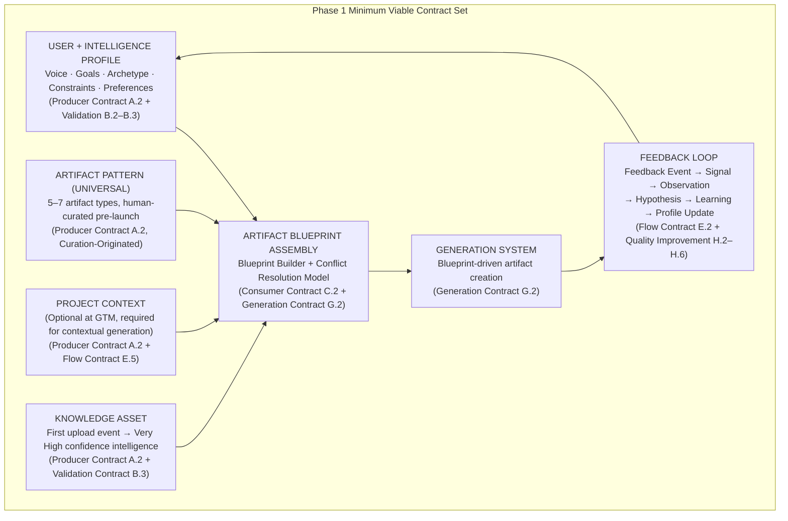

**What this minimum set delivers (per Logical Schema K.5):**
- +70% relevance to User goals (Goal entities active)
- +60% voice/style match (Preference/Voice model active)
- +80% project-grounded accuracy (Project entities active)
- +45% structure quality (Artifact Pattern entities active)
- +80% artifact authenticity (Knowledge Asset entities active)
- Compounding quality from Session 1 (Feedback Event → Signal → Learning loop active)

---

## J.6 — Phase-Based Deployment Summary

| Phase | Entities Active | Components Active | Quality Capability | Activation Condition |
|---|---|---|---|---|
| **Phase 1 (GTM)** | User, Intelligence Profile, Archetype, Goal (User), Constraint, Preference, Knowledge Asset, Artifact Pattern (Universal + User-Calibrated), Artifact Blueprint, Artifact, Feedback Event, Signal, (Hypothesis simplified), Learning, Project (optional) | All 15 components at Phase 1 minimum | Personalized, contextual, structure-calibrated artifact generation from Session 1; compounding from every Feedback Event | Must be fully operational before any Phase 2 entity is introduced |
| **Phase 2** | + Relationship, Audience Profile (Specific), Artifact Pattern (Archetype), Hypothesis (full state machine), Conflict (formal records), Knowledge Intelligence (governance), Workspace (multi-user), Operating Principle, Framework | All components at full Phase 2 capability | Named-recipient calibration; team/enterprise; advanced learning pipeline; value-aligned generation | Phase 1 fully stable; defined triggers per J.3 |
| **Phase 3** | + Cross-user aggregation, Temporal/Behavioral Pattern, Emotional Register, Multi-Archetype Weighting, Anticipatory Blueprint, Cross-Project Recognition, Intelligence Versioning | All components at full Phase 3 capability | Ghost-writing quality; anticipatory intelligence; institutional-scale patterns | Scale milestones and data-volume triggers per J.4 |

---

# Appendix — Contract Cross-Reference Index

## Appendix A — Entity-to-Contract Index

For every entity in the Logical Intelligence Schema, this index identifies which sections of this document define its contracts.

| Entity | Producer Contract | Validation Contract | Consumer Contract | Ownership Contract | Quality Contract |
|---|---|---|---|---|---|
| User | A.2 | — | C.2 | F.2 | — |
| Intelligence Profile | A.2 | B.2 (Hypothesis→Learning→Profile) | C.2 | F.2 | H.2–H.6 (updated by all quality events) |
| Archetype | A.2 | B.3 | C.2 | F.2 | H.2 (reinforced by accepted artifacts) |
| Goal (User) | A.2 | B.3 | C.2 | F.2 | H.2 (confirmed by accepted artifacts) |
| Goal (Project) | A.2 | B.3 | C.2 | F.2 | H.3 (substance delta updates project context) |
| Constraint (User) | A.2 | B.3 | C.2 | F.2 | — |
| Constraint (Project) | A.2 | B.3 | C.2 | F.2 | — |
| Constraint (Compliance) | A.2 | B.3 | C.2 | F.2 | G.2 (compliance always 100% threshold) |
| Preference | A.2 | B.3 | C.2 | F.2 | H.2 (reinforced); H.3 (refined by deltas) |
| Framework | A.2 | B.3 | C.2 | F.2 | H.2 (reinforced by accepted artifacts) |
| Operating Principle | A.2 | B.3 | C.2 | F.2 | — |
| Vocabulary Model | A.2 | B.3 | C.2 | F.2 | H.3 (vocabulary delta updates model) |
| Knowledge Asset | A.2 | B.3 | C.2 | F.2 | H.2 (Confirmed on successful artifact use) |
| Relationship | A.2 | B.3 | C.2 | F.2 | H.2 (audience calibration confirmed) |
| Audience Profile (Generic) | A.2 | B.3 | C.2 | F.2 | H.2 (confirmed by accepted artifacts) |
| Audience Profile (Specific) | A.2 | B.3 | C.2 | F.2 | H.2 (confirmed by positive artifact outcomes) |
| Artifact Pattern (Universal) | A.2 | — (curation-validated) | C.2 | F.2 | H.2–H.6 (all quality events contribute to pattern) |
| Artifact Pattern (Archetype) | A.2 | B.3 | C.2 | F.2 | H.2–H.6 |
| Artifact Pattern (User-Calibrated) | A.2 | B.3 | C.2 | F.2 | H.2–H.6 |
| Artifact Blueprint | A.2 | — (output of assembly process) | C.2 | F.2 | G.2 (quality evaluation post-generation) |
| Artifact Exemplar | A.2 | B.3 | C.2 | F.2 | H.5 (Exemplar contract) |
| Artifact | A.2 | — (output) | C.2 | F.2 | H.2–H.5 (depends on outcome type) |
| Feedback Event | A.2 | B.3 | C.2 | F.2 | H.2–H.6 (all quality improvement contracts) |
| Signal | A.2 | B.2 (Signal→Observation) | C.2 | F.2 | — |
| Observation | A.2 | B.2 | C.2 | F.2 | — |
| Hypothesis | A.2 | B.2 (Hypothesis→Learning) | C.2 | F.2 | — |
| Learning | A.2 | B.2 (Learning→Profile) | C.2 | F.2 | — |
| Conflict | A.2 | B.3 | C.2 | F.2 | E.8 (Conflict Flow) |
| Project | A.2 | B.3 | C.2 | F.2 | E.5 (Project Flow) |
| Workspace | A.2 | B.3 | C.2 | F.2 | — |

---

## Appendix B — Architecture Traceability Table

Every contract in this document traces directly to at least one approved authority document. This table confirms traceability and prevents unauthorized derivation.

| Contract | Traces To (Authority Document + Section) |
|---|---|
| Signal Producer Contract | Logical Schema B.9; Architecture G.1 Stage 1; Taxonomy H |
| Observation → Hypothesis Validation | Logical Schema D.1 Stage 2–3, B.10–B.11 |
| Hypothesis → Learning Validation | Logical Schema D.1 Stage 4–5, B.11–B.12, D.3–D.4 |
| Learning → Profile Validation | Logical Schema D.1 Stage 6, B.2 |
| Archetype Validation Contract | Logical Schema B.3; Taxonomy B.2 |
| Preference Validation Contract | Logical Schema B.6; Taxonomy H.1 |
| Knowledge Asset Contract | Logical Schema B.8, I.4–I.5; Architecture D.4 |
| Intelligence Consumer Priority Order | Architecture H.2 (Eight Transformation Stages); F.2 (Three-Level Stack) |
| Board Update Composition Model | Architecture G.2 (Board Update flow table) |
| Strategy Document Composition | Architecture G.2 (Strategy Document flow table) |
| Architecture Proposal Composition | Architecture G.2 |
| Research Paper Composition | Architecture G.2 |
| Product Roadmap Composition | Architecture G.2 |
| Investor Update Composition | Architecture G.2 |
| LinkedIn Post Composition | Architecture G.2 |
| Feedback Flow Contract | Architecture D.4 (Artifact Reinforcement Cycle); Taxonomy E.1–E.2, F.1–F.2 |
| Knowledge Asset Flow | Logical Schema I.5; Architecture D |
| Project Flow | Logical Schema G.2–G.5; Architecture C.4 |
| Relationship Flow | Logical Schema B.13, E.4 (Relationship Lifecycle); Architecture E.4 |
| User Correction Flow | Logical Schema D.3 (Correction Override Rule) |
| Conflict Flow | Logical Schema J.1–J.6; Architecture I.2–I.5 |
| Ownership Boundary Rules | Logical Schema F.1–F.2; Architecture B.1–B (Domain Boundaries) |
| Quality Improvement Contracts | Taxonomy E.1–E.2, F.1–F.2; Architecture D.4–D.5; Logical Schema H.4 |
| Compounding Timeline | Architecture J.3 (Intelligence Maturation Curve); Logical Schema H.5 |
| Phase 1 Contract Set | Logical Schema K.1–K.5; Architecture K.1–K.6; Taxonomy I.1–I.3 |
| Phase 2 Contract Set | Logical Schema K.3; Architecture K.4 |
| Phase 3 Contract Set | Logical Schema K.4; Architecture K.5 (Deferred Domains) |
| Signal Extractor Component | Logical Schema D.1 Stage 1; Architecture G.1 |
| Blueprint Builder Component | Architecture H.2 (Stage 1–8); Logical Schema L.2 |
| Conflict Resolution Model Component | Logical Schema J.2–J.6; Architecture I.2–I.5 |

---

## Appendix C — Governing Contract Principles Summary

Consolidated from all sections above. These seven principles govern every contract in this document and must be enforced in implementation.

| Principle | Statement | Source |
|---|---|---|
| **Intelligence, Not Information** | Every entity produced by this system must carry a confidence score and source reference. Raw storage without validation is not intelligence. | Taxonomy Closing Design Principles; Logical Schema L.3 |
| **User Correction is Sacred** | An explicit User correction immediately sets the corrected Learning to Confirmed confidence, bypassing the normal corroboration threshold. No other contract may delay or gate a User correction. | Logical Schema D.3 (Correction Override Rule); Taxonomy Closing Design Principles |
| **Context Isolation is Non-Negotiable** | Every Learning must be applied within the context in which it was observed. A brevity preference in executive summaries does not grant brevity authority in research papers. | Logical Schema D.3 (Context Isolation Rule); Taxonomy Closing Design Principles |
| **Specificity Compounds** | The most specific intelligence to the current task wins within its scope. User-Calibrated patterns override Universal patterns. Named Relationship profiles override generic Audience Profiles. | Logical Schema J.4 (Scope Rule); Architecture L.5 |
| **Domain Boundaries Are Hard** | No component may write to a domain store it does not own. No entity may be created without passing through its defined Validation Contract. Blueprint write exclusivity is absolute. | Section F.3 (Ownership Boundary Enforcement Rules) |
| **The Artifact is the Output** | All intelligence exists to serve artifact generation. Every contract is evaluated through the lens of its contribution to artifact quality. | Architecture L.5 (Governing Design Principles) |
| **False Learning is More Dangerous Than No Learning** | A confident but wrong model degrades every artifact while appearing calibrated. The exclusion framework (quarantine gate, context isolation, minimum corroboration thresholds) exists to protect model integrity. | Taxonomy H.1 (Core Exclusion Principle) |

---

## Appendix D — Document Completion Confirmation

This document derives from and is fully consistent with the three approved authority documents:

```
BrandOS Learning Taxonomy v1.0
  ↓ defines what is learned
BrandOS Intelligence Architecture v1.0
  ↓ defines how it is organized and consumed
BrandOS Logical Intelligence Schema v1.0
  ↓ defines entities, relationships, lifecycle, state machine, conflicts
BrandOS Intelligence Contracts [THIS DOCUMENT]
  ↓ defines producers, validators, consumers, flows, ownership, generation contracts, quality contracts, runtime components, phase roadmap
Implementation
```

Every entity defined in the Logical Schema has a Producer Contract (Section A), a Validation Contract (Section B), a Consumer Contract (Section C), and an Ownership Contract (Section F). Every major intelligence flow defined in the Architecture has a Flow Contract (Section E). Every artifact type with a composition analysis in the Architecture has a Composition Model (Section D). The Quality Improvement contracts (Section H) formalize the Artifact Reinforcement Cycle from Architecture Section D.4. The Runtime Components (Section I) correspond 1:1 to the processing stages in Architecture Section H.2. The Phase-Based Implementation Recommendation (Section J) is directly derived from Logical Schema Section K and Architecture Section K.

No entity has been introduced that is not required by the authority documents. No entity required by the authority documents has been omitted from contract coverage.

---

*BrandOS Intelligence Contracts · Confidential · Architecture Bridge Document*
*Derived from: BrandOS Brand Intelligence Learning Framework v1.0 · BrandOS Intelligence Architecture v1.0 · BrandOS Logical Intelligence Schema v1.0*
*Intended storage path: `docs/architecture/intelligence/BrandOS_Intelligence_Contracts.md`*
